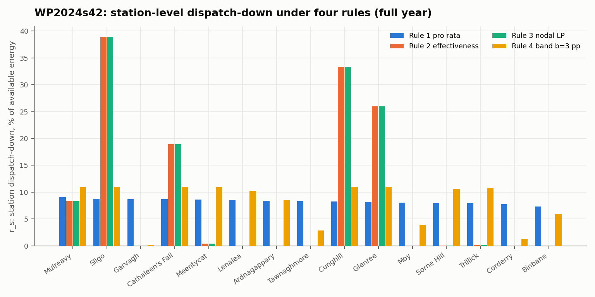
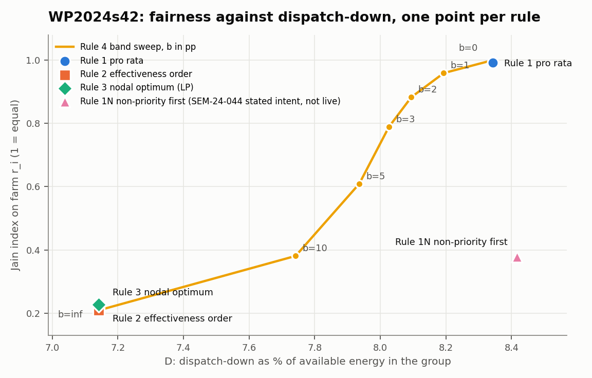
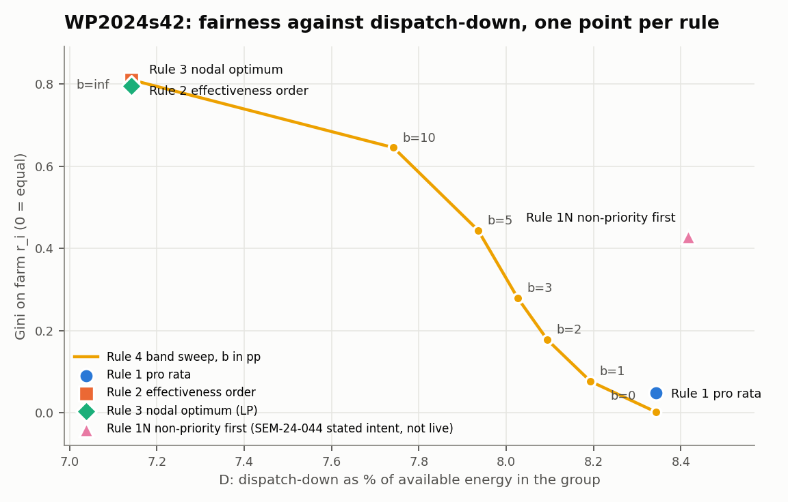
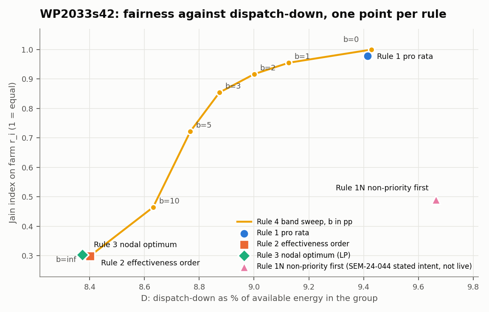
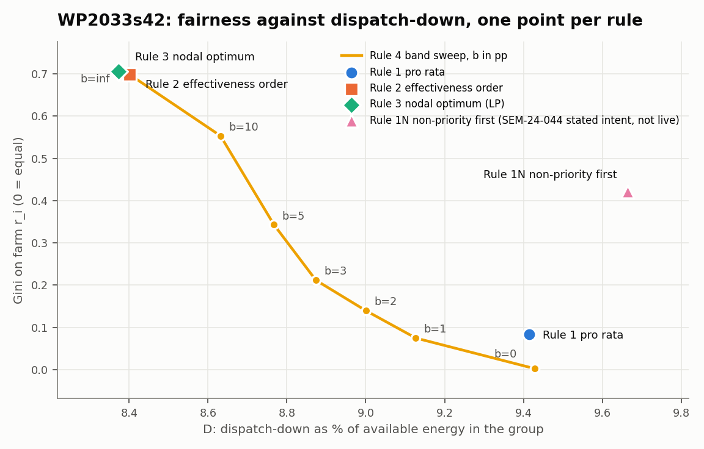
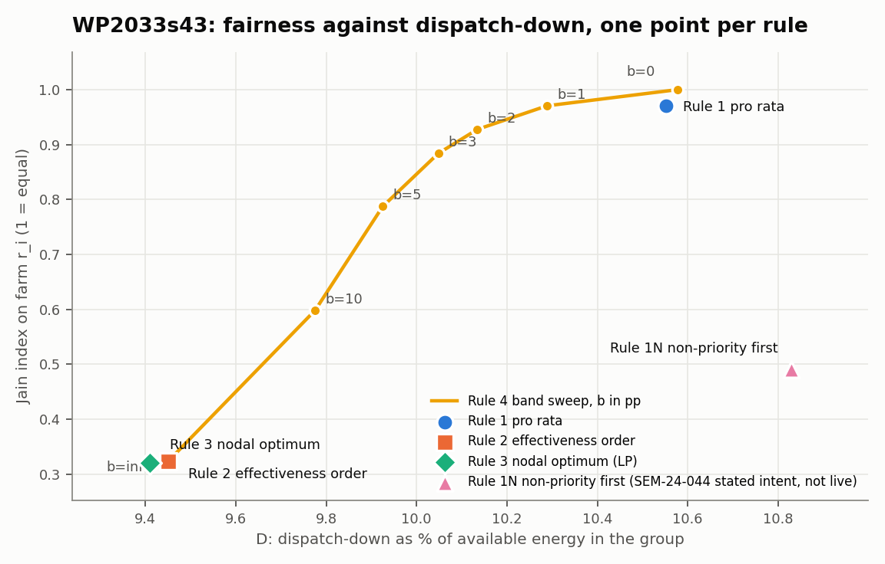
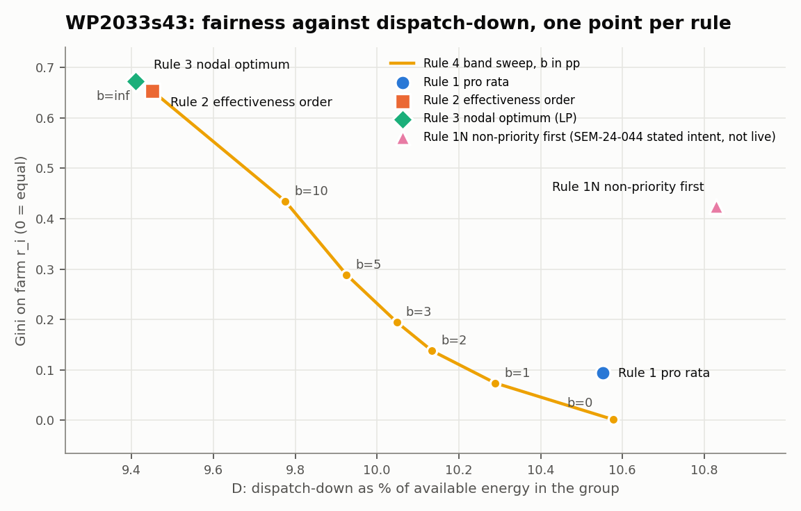

# RESULTS — The price of pro-rata: constraint-group dispatch on the Irish grid

Generated by `src/results_md.py`. Every number below is read from the named file under `out/`; nothing is typed by hand. Units: MW, MWh, %, hours. Specification: `MASTER.md`; unspecified choices: `out/DECISIONS_LOG.md`.

## 1. What was run

Simulated group: North-West Constraint Group 3 (WDT Overview §3.3). Tie: line `3581-89516-1` replaced by Link `LKY-STRABANE-PST`. Contingency: loss of `2522-5042-1` (Flagford–Srananagh 220 kV). Monitored rows: FLG_SLIGO_N1 = `2521-4981-1` post-contingency, T25221_N1 = `T2522-2521-25221-1-w1` post-contingency, T25222_N1 = `T2522-2521-25222-2-w1` post-contingency, FLG_SLIGO_N0 = `2521-4981-1` intact.

| case      |   hours |   step_h |   tie_p_nom_MW | reference_bus                             |   units_at_CG3 |   match_rate_pct |   unmatched |   n_G |   n_U |   n_P |   n_N |   MW_G |   MW_excluded_U |   borrowed_profiles |   borrowed_MW | year_cols   | chunks_optimal   |   solve_min |
|:----------|--------:|---------:|---------------:|:------------------------------------------|---------------:|-----------------:|------------:|------:|------:|------:|------:|-------:|----------------:|--------------------:|--------------:|:------------|:-----------------|------------:|
| WP2024s42 |    8760 |        1 |           93.0 | 2742 GREAT ISLAND (27474-1, 464.5 MW gas) |             66 |             77.3 |          15 |    51 |    15 |    45 |     6 |  686.4 |            50.5 |                  32 |        1037.5 | 462/541     | True             |        43.2 |
| WP2033s42 |    4380 |        2 |          123.0 | 2742 GREAT ISLAND (27474-1, 465.5 MW gas) |             72 |             77.8 |          16 |    57 |    15 |    46 |    11 |  752.1 |            50.5 |                  82 |        7770.4 | 594/710     | True             |        30.0 |
| WP2033s43 |    4380 |        2 |          123.0 | 2742 GREAT ISLAND (27474-1, 465.5 MW gas) |             72 |             77.8 |          16 |    57 |    15 |    46 |    11 |  752.1 |            50.5 |                  82 |        7770.4 | 594/710     | True             |        32.6 |

Sources: `<case>_baseline_sanity.json` (hours, step, tie, borrowed profiles, year columns, chunk status, solve time), `<case>_group_stats.json` (units, match rate, classes, MW in G and excluded), `<case>_ptdf_summary.json` and `<case>_reference_bus.csv` (reference bus). Borrowed profiles are listed generator by generator in `<case>_profile_borrowing.csv`; the CG3 units with their class and match status in `<case>_group_units.csv`. Unmatched units default to class P (MASTER §2.1); the list is in `out/ENGINE_NOTES.md`.

Baseline sanity (`<case>_baseline_sanity.json`): surplus share = 1 − dispatched/available in the unconstrained dispatch (ratings ×100); tie at cap = share of hours with |link flow| at p_nom.

| case      |   wind_surplus_share_pct |   G_surplus_share_pct |   load_shedding_hours |   tie_at_cap_share_pct |   tie_mean_flow_MW |
|:----------|-------------------------:|----------------------:|----------------------:|-----------------------:|-------------------:|
| WP2024s42 |                     1.94 |                  1.64 |                     0 |                 100.00 |              91.90 |
| WP2033s42 |                    11.16 |                  8.86 |                     0 |                 100.00 |             -98.23 |
| WP2033s43 |                    10.67 |                  8.57 |                     0 |                 100.00 |             -97.95 |

## 2. Overload statistics (`<case>_overload_stats.json`, series in `<case>_overloads.csv`)

| case      |   hours |   hours_any_overload |   share_pct |   total_overload_MWh |   max_overload_MW | max_row        |   multi_row_share_pct |   hours_multi_row |
|:----------|--------:|---------------------:|------------:|---------------------:|------------------:|:---------------|----------------------:|------------------:|
| WP2024s42 |    8760 |                 1308 |        14.9 |              34817.1 |              84.0 | O_FLG_SLIGO_N1 |                   0.3 |                 4 |
| WP2033s42 |    4380 |                  718 |        16.4 |              63271.1 |              98.5 | O_FLG_SLIGO_N1 |                  58.5 |               420 |
| WP2033s43 |    4380 |                  777 |        17.7 |              73710.8 |             109.5 | O_FLG_SLIGO_N1 |                  60.5 |               470 |

| case      | row          | element               |   rating_MVA |   hours_over |   overload_MWh |   max_overload_MW |   max_abs_flow_MW |
|:----------|:-------------|:----------------------|-------------:|-------------:|---------------:|------------------:|------------------:|
| WP2024s42 | FLG_SLIGO_N1 | 2521-4981-1           |        121.0 |         1308 |        34797.4 |              84.0 |             205.0 |
| WP2024s42 | T25221_N1    | T2522-2521-25221-1-w1 |        125.0 |            0 |            0.0 |               0.0 |             115.3 |
| WP2024s42 | T25222_N1    | T2522-2521-25222-2-w1 |        125.0 |            0 |            0.0 |               0.0 |             110.9 |
| WP2024s42 | FLG_SLIGO_N0 | 2521-4981-1           |        121.0 |            4 |           19.8 |               9.2 |             130.2 |
| WP2033s42 | FLG_SLIGO_N1 | 2521-4981-1           |        121.0 |          712 |        38676.3 |              98.5 |             219.5 |
| WP2033s42 | T25221_N1    | T2522-2521-25221-1-w1 |        125.0 |          425 |        14365.6 |              63.3 |             188.3 |
| WP2033s42 | T25222_N1    | T2522-2521-25222-2-w1 |        125.0 |          344 |        10157.8 |              56.1 |             181.1 |
| WP2033s42 | FLG_SLIGO_N0 | 2521-4981-1           |        121.0 |            6 |           71.4 |              10.1 |             131.1 |
| WP2033s43 | FLG_SLIGO_N1 | 2521-4981-1           |        121.0 |          774 |        43094.6 |             109.5 |             230.5 |
| WP2033s43 | T25221_N1    | T2522-2521-25221-1-w1 |        125.0 |          473 |        17589.5 |              72.1 |             197.1 |
| WP2033s43 | T25222_N1    | T2522-2521-25222-2-w1 |        125.0 |          384 |        12832.8 |              64.5 |             189.5 |
| WP2033s43 | FLG_SLIGO_N0 | 2521-4981-1           |        121.0 |           18 |          193.9 |              15.2 |             136.2 |

Overload MWh = Σ_h O_m,h × step. The WP2033 cases are sampled every 2nd hour, so their hour counts are out of 4,380 and MWh are 2 × Σ MW.

## 3. Shift factors and the step change (`<case>_node_table.csv`, `<case>_ptdf_summary.json`, `<case>_shift_factors.csv`)

Rows are oriented so that the availability-weighted mean shift factor of the CG3 nodes is positive (the group's export direction; orientation sign in `<case>_ptdf_summary.json`). Raw signed values (PyPSA p0 convention) are in `<case>_shift_factors.csv`; the rules use SF_eff = sign(F_m,h) · SF_raw, verified in `WP2024s42_sf_convention_check.csv` (§10).

**WP2024s42** — nodes with SF ≥ 0.02 on the Flagford–Sligo N-1 row (32 of 156 wind/solar nodes). Step change: largest ratio 1.753 between rank 22 (BELLACORICK, 0.1612) and the next (0.0920). CG3 nodes occupy ranks 1–18 (SF 0.1872–0.3376); CG3 nodes below the step: none; non-CG3 nodes above the step: ['GOLAGH', 'CROAGHONAGH', 'LETTERKENNY', 'SRAHNAKILLY', 'BELLACORICK', 'CROAGHAUN', 'BELLACORICK'].

|   bus | psse_name    | station          | in_CG3   |   ws_p_nom |   SF_FLG_SLIGO_N1 |   SF_T25221_N1 |   SF_T25222_N1 |   ratio_to_next | step_change   |
|------:|:-------------|:-----------------|:---------|-----------:|------------------:|---------------:|---------------:|----------------:|:--------------|
|  4981 | SLIGO        | Sligo            | True     |    13.6500 |            0.3376 |         0.1645 |         0.1582 |          1.1456 | False         |
|  1931 | CUNGHILL     | Cunghill         | True     |    34.8000 |            0.2947 |         0.1440 |         0.1385 |          1.2211 | False         |
|  4371 | GLENREE      | Glenree          | True     |    77.3000 |            0.2413 |         0.1186 |         0.1141 |          1.1035 | False         |
| 17010 | CATH FALL    | Cathaleen's Fall | True     |    17.5000 |            0.2187 |         0.1388 |         0.1335 |          1.0001 | False         |
|  4091 | MULREAVY     | Mulreavy         | True     |    95.2500 |            0.2187 |         0.1388 |         0.1335 |          1.0000 | False         |
|  2801 | GOLAGH       | nan              | False    |    15.0000 |            0.2187 |         0.1388 |         0.1335 |          1.0000 | False         |
| 51911 | CROAGHONAGH  | nan              | False    |   139.2000 |            0.2187 |         0.1388 |         0.1335 |          1.0000 | False         |
|  4071 | MEENTYCAT    | Meentycat        | True     |    84.9600 |            0.2187 |         0.1388 |         0.1335 |          1.0000 | False         |
|  3581 | LETTERKENNY  | nan              | False    |    40.2700 |            0.2187 |         0.1388 |         0.1335 |          1.0000 | False         |
|  5361 | TRILLICK     | Trillick         | True     |    44.6900 |            0.2187 |         0.1388 |         0.1335 |          1.0000 | False         |
|  4991 | SORNE HILL   | Sorne Hill       | True     |    63.2500 |            0.2187 |         0.1388 |         0.1335 |          1.0000 | False         |
|  3591 | LENALEA      | Lenalea          | True     |    30.5000 |            0.2187 |         0.1388 |         0.1335 |          1.0000 | False         |
|  1571 | ARDNAGAPPARY | Ardnagappary     | True     |    22.9400 |            0.2187 |         0.1388 |         0.1335 |          1.0000 | False         |
|  1341 | BINBANE      | Binbane          | True     |    70.8000 |            0.2187 |         0.1388 |         0.1335 |          1.0266 | False         |
|  4041 | MOY          | Moy              | True     |     6.0000 |            0.2130 |         0.1051 |         0.1011 |          1.0000 | False         |
|  5241 | TAWNAGHMORE  | Tawnaghmore      | True     |    30.0000 |            0.2130 |         0.1051 |         0.1011 |          1.1381 | False         |
|  1631 | CORDERRY     | Corderry         | True     |    63.2530 |            0.1872 |         0.1770 |         0.1702 |          1.0000 | False         |
|  2671 | GARVAGH      | Garvagh          | True     |    82.0000 |            0.1872 |         0.1770 |         0.1702 |          1.1607 | False         |
| 14013 | SRAHNAKILLY  | nan              | False    |   172.0000 |            0.1612 |         0.0804 |         0.0774 |          1.0000 | False         |
| 14010 | BELLACORICK  | nan              | False    |    33.9000 |            0.1612 |         0.0804 |         0.0774 |          1.0000 | False         |
| 14016 | CROAGHAUN    | nan              | False    |    50.0000 |            0.1612 |         0.0804 |         0.0774 |          1.0000 | False         |
|  1401 | BELLACORICK  | nan              | False    |     9.0000 |            0.1612 |         0.0804 |         0.0774 |          1.7528 | True          |
|  1061 | ARIGNA       | nan              | False    |    15.6000 |            0.0920 |         0.1899 |         0.1826 |          1.0764 | False         |
|  1661 | CASTLEBAR    | nan              | False    |    50.4400 |            0.0855 |         0.0443 |         0.0426 |          1.4012 | False         |
|  2281 | DALTON_A1    | nan              | False    |    40.8000 |            0.0610 |         0.0274 |         0.0264 |          1.0004 | False         |
| 22811 | DALTON_A2    | nan              | False    |     2.5500 |            0.0610 |         0.0274 |         0.0264 |          1.0880 | False         |
|  2821 | GORTAWEE     | nan              | False    |     3.0000 |            0.0560 |         0.0796 |         0.0765 |          1.5759 | False         |
| 79010 | ENNISKIL     | nan              | False    |    16.9000 |            0.0356 |         0.0339 |         0.0326 |          1.0000 | False         |
| 70010 | AGHYOULE     | nan              | False    |    82.5000 |            0.0356 |         0.0339 |         0.0326 |          1.4545 | False         |
| 77210 | DRUMQUIN     | nan              | False    |    67.9000 |            0.0244 |         0.0204 |         0.0196 |          1.2042 | False         |
| 87510 | OMAH1-       | nan              | False    |    95.7000 |            0.0203 |         0.0154 |         0.0148 |          1.0000 | False         |
| 85510 | MAKL1-CL     | nan              | False    |    70.6000 |            0.0203 |         0.0154 |         0.0148 |        nan      | False         |

**WP2033s42** — nodes with SF ≥ 0.02 on the Flagford–Sligo N-1 row (34 of 218 wind/solar nodes). Step change: largest ratio 1.445 between rank 26 (GORTAWEE, 0.0561) and the next (0.0388). CG3 nodes occupy ranks 1–21 (SF 0.0900–0.3180); CG3 nodes below the step: none; non-CG3 nodes above the step: ['CROAGHONAGH', 'LETTERKENNY', 'TIEVEBRACK', 'AGHALEAGUE', 'FIRLOUGH', 'ARIGNA', 'BELLACORICK', 'BELLACORICK', 'CROAGHAUN', 'SRAHNAKILLY', 'GORTAWEE'].

|   bus | psse_name    | station          | in_CG3   |   ws_p_nom |   SF_FLG_SLIGO_N1 |   SF_T25221_N1 |   SF_T25222_N1 |   ratio_to_next | step_change   |
|------:|:-------------|:-----------------|:---------|-----------:|------------------:|---------------:|---------------:|----------------:|:--------------|
|  4981 | SLIGO        | Sligo            | True     |    17.7300 |            0.3180 |         0.1723 |         0.1657 |          1.3106 | False         |
|  1931 | CUNGHILL     | Cunghill         | True     |    34.8000 |            0.2427 |         0.1659 |         0.1595 |          1.1576 | False         |
| 17010 | CATH FALL    | Cathaleen's Fall | True     |    55.0000 |            0.2096 |         0.1439 |         0.1384 |          1.0001 | False         |
|  4091 | MULREAVY     | Mulreavy         | True     |    95.2500 |            0.2096 |         0.1439 |         0.1384 |          1.0000 | False         |
| 51911 | CROAGHONAGH  | nan              | False    |   139.2000 |            0.2096 |         0.1439 |         0.1384 |          1.0000 | False         |
|  4071 | MEENTYCAT    | Meentycat        | True     |    84.9600 |            0.2096 |         0.1439 |         0.1384 |          1.0000 | False         |
|  3581 | LETTERKENNY  | nan              | False    |    60.2700 |            0.2096 |         0.1439 |         0.1384 |          1.0000 | False         |
|  5361 | TRILLICK     | Trillick         | True     |    44.6900 |            0.2096 |         0.1439 |         0.1384 |          1.0000 | False         |
|  4991 | SORNE HILL   | Sorne Hill       | True     |    63.2500 |            0.2096 |         0.1439 |         0.1384 |          1.0000 | False         |
|  3591 | LENALEA      | Lenalea          | True     |    30.5000 |            0.2096 |         0.1439 |         0.1384 |          1.0000 | False         |
|  5191 | TIEVEBRACK   | nan              | False    |    29.9000 |            0.2096 |         0.1439 |         0.1384 |          1.0000 | False         |
|  1571 | ARDNAGAPPARY | Ardnagappary     | True     |    22.9400 |            0.2096 |         0.1439 |         0.1384 |          1.0000 | False         |
|  1341 | BINBANE      | Binbane          | True     |    89.3000 |            0.2096 |         0.1439 |         0.1383 |          1.1445 | False         |
|  1631 | CORDERRY     | Corderry         | True     |    79.6030 |            0.1831 |         0.1790 |         0.1722 |          1.0000 | False         |
|  2671 | GARVAGH      | Garvagh          | True     |    82.0000 |            0.1831 |         0.1790 |         0.1722 |          1.0000 | False         |
|  2661 | AGHALEAGUE   | nan              | False    |    40.0000 |            0.1831 |         0.1790 |         0.1722 |          1.2297 | False         |
|  4371 | GLENREE      | Glenree          | True     |    77.3000 |            0.1489 |         0.1578 |         0.1518 |          1.0903 | False         |
|  2601 | FIRLOUGH     | nan              | False    |    75.6000 |            0.1366 |         0.1568 |         0.1508 |          1.4165 | False         |
|  1061 | ARIGNA       | nan              | False    |    15.6000 |            0.0964 |         0.1880 |         0.1808 |          1.0709 | False         |
|  4041 | MOY          | Moy              | True     |     6.0000 |            0.0900 |         0.1528 |         0.1469 |          1.0000 | False         |
|  5241 | TAWNAGHMORE  | Tawnaghmore      | True     |    19.2000 |            0.0900 |         0.1528 |         0.1469 |          1.3638 | False         |
| 14010 | BELLACORICK  | nan              | False    |    33.9000 |            0.0660 |         0.1152 |         0.1108 |          1.0000 | False         |
|  1401 | BELLACORICK  | nan              | False    |    46.8900 |            0.0660 |         0.1152 |         0.1108 |          1.0000 | False         |
| 14016 | CROAGHAUN    | nan              | False    |    50.0000 |            0.0660 |         0.1152 |         0.1108 |          1.0000 | False         |
| 14013 | SRAHNAKILLY  | nan              | False    |   172.0000 |            0.0660 |         0.1152 |         0.1108 |          1.1761 | False         |
|  2821 | GORTAWEE     | nan              | False    |     8.0000 |            0.0561 |         0.0829 |         0.0797 |          1.4455 | True          |
|  5341 | TONROE       | nan              | False    |    12.0400 |            0.0388 |         0.1737 |         0.1670 |          1.1474 | False         |
| 79010 | ENNISKIL     | nan              | False    |    16.9000 |            0.0338 |         0.0343 |         0.0330 |          1.0000 | False         |
| 70010 | AGHYOULE     | nan              | False    |    82.5000 |            0.0338 |         0.0343 |         0.0330 |          1.0356 | False         |
|  1661 | CASTLEBAR    | nan              | False    |    50.4400 |            0.0327 |         0.0631 |         0.0607 |          1.4361 | False         |
|  2281 | DALTON_A1    | nan              | False    |    44.8000 |            0.0228 |         0.0420 |         0.0404 |          1.0005 | False         |
| 22811 | DALTON_A2    | nan              | False    |     2.5500 |            0.0227 |         0.0420 |         0.0404 |          1.0068 | False         |
| 77210 | DRUMQUIN     | nan              | False    |    67.9000 |            0.0226 |         0.0200 |         0.0192 |          1.0000 | False         |
| 77212 | WIND_PT      | nan              | False    |    51.6000 |            0.0226 |         0.0200 |         0.0192 |        nan      | False         |

**WP2033s43** — nodes with SF ≥ 0.02 on the Flagford–Sligo N-1 row (34 of 218 wind/solar nodes). Step change: largest ratio 1.445 between rank 26 (GORTAWEE, 0.0561) and the next (0.0388). CG3 nodes occupy ranks 1–21 (SF 0.0900–0.3180); CG3 nodes below the step: none; non-CG3 nodes above the step: ['CROAGHONAGH', 'LETTERKENNY', 'TIEVEBRACK', 'AGHALEAGUE', 'FIRLOUGH', 'ARIGNA', 'BELLACORICK', 'BELLACORICK', 'CROAGHAUN', 'SRAHNAKILLY', 'GORTAWEE'].

|   bus | psse_name    | station          | in_CG3   |   ws_p_nom |   SF_FLG_SLIGO_N1 |   SF_T25221_N1 |   SF_T25222_N1 |   ratio_to_next | step_change   |
|------:|:-------------|:-----------------|:---------|-----------:|------------------:|---------------:|---------------:|----------------:|:--------------|
|  4981 | SLIGO        | Sligo            | True     |    17.7300 |            0.3180 |         0.1723 |         0.1657 |          1.3106 | False         |
|  1931 | CUNGHILL     | Cunghill         | True     |    34.8000 |            0.2427 |         0.1659 |         0.1595 |          1.1576 | False         |
| 17010 | CATH FALL    | Cathaleen's Fall | True     |    55.0000 |            0.2096 |         0.1439 |         0.1384 |          1.0001 | False         |
|  4091 | MULREAVY     | Mulreavy         | True     |    95.2500 |            0.2096 |         0.1439 |         0.1384 |          1.0000 | False         |
| 51911 | CROAGHONAGH  | nan              | False    |   139.2000 |            0.2096 |         0.1439 |         0.1384 |          1.0000 | False         |
|  4071 | MEENTYCAT    | Meentycat        | True     |    84.9600 |            0.2096 |         0.1439 |         0.1384 |          1.0000 | False         |
|  3581 | LETTERKENNY  | nan              | False    |    60.2700 |            0.2096 |         0.1439 |         0.1384 |          1.0000 | False         |
|  5361 | TRILLICK     | Trillick         | True     |    44.6900 |            0.2096 |         0.1439 |         0.1384 |          1.0000 | False         |
|  4991 | SORNE HILL   | Sorne Hill       | True     |    63.2500 |            0.2096 |         0.1439 |         0.1384 |          1.0000 | False         |
|  3591 | LENALEA      | Lenalea          | True     |    30.5000 |            0.2096 |         0.1439 |         0.1384 |          1.0000 | False         |
|  5191 | TIEVEBRACK   | nan              | False    |    29.9000 |            0.2096 |         0.1439 |         0.1384 |          1.0000 | False         |
|  1571 | ARDNAGAPPARY | Ardnagappary     | True     |    22.9400 |            0.2096 |         0.1439 |         0.1384 |          1.0000 | False         |
|  1341 | BINBANE      | Binbane          | True     |    89.3000 |            0.2096 |         0.1439 |         0.1383 |          1.1445 | False         |
|  1631 | CORDERRY     | Corderry         | True     |    79.6030 |            0.1831 |         0.1790 |         0.1722 |          1.0000 | False         |
|  2671 | GARVAGH      | Garvagh          | True     |    82.0000 |            0.1831 |         0.1790 |         0.1722 |          1.0000 | False         |
|  2661 | AGHALEAGUE   | nan              | False    |    40.0000 |            0.1831 |         0.1790 |         0.1722 |          1.2297 | False         |
|  4371 | GLENREE      | Glenree          | True     |    77.3000 |            0.1489 |         0.1578 |         0.1518 |          1.0903 | False         |
|  2601 | FIRLOUGH     | nan              | False    |    75.6000 |            0.1366 |         0.1568 |         0.1508 |          1.4165 | False         |
|  1061 | ARIGNA       | nan              | False    |    15.6000 |            0.0964 |         0.1880 |         0.1808 |          1.0709 | False         |
|  4041 | MOY          | Moy              | True     |     6.0000 |            0.0900 |         0.1528 |         0.1469 |          1.0000 | False         |
|  5241 | TAWNAGHMORE  | Tawnaghmore      | True     |    19.2000 |            0.0900 |         0.1528 |         0.1469 |          1.3638 | False         |
| 14010 | BELLACORICK  | nan              | False    |    33.9000 |            0.0660 |         0.1152 |         0.1108 |          1.0000 | False         |
|  1401 | BELLACORICK  | nan              | False    |    46.8900 |            0.0660 |         0.1152 |         0.1108 |          1.0000 | False         |
| 14016 | CROAGHAUN    | nan              | False    |    50.0000 |            0.0660 |         0.1152 |         0.1108 |          1.0000 | False         |
| 14013 | SRAHNAKILLY  | nan              | False    |   172.0000 |            0.0660 |         0.1152 |         0.1108 |          1.1761 | False         |
|  2821 | GORTAWEE     | nan              | False    |     8.0000 |            0.0561 |         0.0829 |         0.0797 |          1.4455 | True          |
|  5341 | TONROE       | nan              | False    |    12.0400 |            0.0388 |         0.1737 |         0.1670 |          1.1474 | False         |
| 79010 | ENNISKIL     | nan              | False    |    16.9000 |            0.0338 |         0.0343 |         0.0330 |          1.0000 | False         |
| 70010 | AGHYOULE     | nan              | False    |    82.5000 |            0.0338 |         0.0343 |         0.0330 |          1.0356 | False         |
|  1661 | CASTLEBAR    | nan              | False    |    50.4400 |            0.0327 |         0.0631 |         0.0607 |          1.4361 | False         |
|  2281 | DALTON_A1    | nan              | False    |    44.8000 |            0.0228 |         0.0420 |         0.0404 |          1.0005 | False         |
| 22811 | DALTON_A2    | nan              | False    |     2.5500 |            0.0227 |         0.0420 |         0.0404 |          1.0068 | False         |
| 77210 | DRUMQUIN     | nan              | False    |    67.9000 |            0.0226 |         0.0200 |         0.0192 |          1.0000 | False         |
| 77212 | WIND_PT      | nan              | False    |    51.6000 |            0.0226 |         0.0200 |         0.0192 |        nan      | False         |

The document's App. 2 table lists the group's nodes with their shift factor and a 'significant step change' below the last member; the modelled group is checked against it by the rank range of the CG3 nodes and the non-CG3 nodes that sit above the step (those are North-West nodes outside CG3: Group 1 territory and the Bellacorick/Srahnakilly cluster, which the document handles in other groups).

## 4. Rule results per case (`<case>_summary.csv`; per-farm `<case>_farm_r.csv`; per-station `<case>_station_r.csv`)

D = Σ cum_cut / Σ cum_avail over G (%, constraint only). D_ratio = D/D_rule1. PoF_eff = (D − D_rule2)/D_rule2, PoF_nodal = (D − D_rule3)/D_rule3. Jain on farm r_i and on station r_s; Gini on farm r_i (ascending sort, unweighted, no small-sample correction). worst = max r_i / r̄; max/min over farms with cum_avail > 0 (inf when a farm in G is never cut). Residual hours = hours whose overload could not be cleared (§4); post-cut violations = hour-branch pairs on the North-West list newly over rating after the cut (§4.6, `<case>_postcut_violations.csv`, branch detail in `<case>_postcut_by_branch.csv`).

**WP2024s42** (`WP2024s42_summary.csv`; cut and available energy in the same file: Σ cum_avail over G = 1883891 MWh, hours with a cut = 1308, |G| = 51)

| rule                                                            |   D_pct |   D_ratio |   PoF_eff |   PoF_nodal |   Jain_farm |   Jain_station |   Gini |   worst_over_mean |   max_over_min |   residual_hours |   postcut_violations |
|:----------------------------------------------------------------|--------:|----------:|----------:|------------:|------------:|---------------:|-------:|------------------:|---------------:|-----------------:|---------------------:|
| Rule 1 pro rata (today)                                         |  8.3434 |    1.0000 |    0.1683 |      0.1683 |      0.9919 |         0.9974 | 0.0480 |            1.0862 |         1.4408 |                0 |                    0 |
| Rule 2 effectiveness order                                      |  7.1414 |    0.8559 |    0.0000 |      0.0000 |      0.2093 |         0.2844 | 0.8106 |            5.4473 |       inf      |                0 |                    0 |
| Rule 3 nodal optimum (LP)                                       |  7.1414 |    0.8559 |    0.0000 |      0.0000 |      0.2272 |         0.2844 | 0.7958 |            5.5302 |       inf      |                0 |                    0 |
| Rule 1N non-priority first (SEM-24-044 stated intent, not live) |  8.4161 |    1.0087 |    0.1785 |      0.1785 |      0.3790 |         0.5283 | 0.4284 |            4.1848 |        10.6178 |                0 |                    0 |
| Rule 4 band b=0                                                 |  8.3438 |    1.0000 |    0.1684 |      0.1684 |      1.0000 |         1.0000 | 0.0011 |            1.0034 |         1.0095 |                0 |                    0 |
| Rule 4 band b=1                                                 |  8.1934 |    0.9820 |    0.1473 |      0.1473 |      0.9589 |         0.9589 | 0.0758 |            1.1256 |         3.7533 |                0 |                    0 |
| Rule 4 band b=2                                                 |  8.0945 |    0.9702 |    0.1335 |      0.1335 |      0.8827 |         0.8936 | 0.1771 |            1.2468 |        11.0193 |                0 |                    0 |
| Rule 4 band b=3                                                 |  8.0264 |    0.9620 |    0.1239 |      0.1239 |      0.7889 |         0.8106 | 0.2792 |            1.3696 |        46.6828 |                0 |                    0 |
| Rule 4 band b=5                                                 |  7.9359 |    0.9512 |    0.1112 |      0.1112 |      0.6092 |         0.6711 | 0.4439 |            1.6232 |       136.8191 |                0 |                    0 |
| Rule 4 band b=10                                                |  7.7420 |    0.9279 |    0.0841 |      0.0841 |      0.3811 |         0.4645 | 0.6454 |            2.2731 |       inf      |                0 |                    0 |
| Rule 4 band b=inf (= rule 2)                                    |  7.1414 |    0.8559 |    0.0000 |      0.0000 |      0.2093 |         0.2844 | 0.8106 |            5.4473 |       inf      |                0 |                    0 |

**WP2033s42** (`WP2033s42_summary.csv`; cut and available energy in the same file: Σ cum_avail over G = 2072924 MWh, hours with a cut = 718, |G| = 57)

| rule                                                            |   D_pct |   D_ratio |   PoF_eff |   PoF_nodal |   Jain_farm |   Jain_station |   Gini |   worst_over_mean |   max_over_min |   residual_hours |   postcut_violations |
|:----------------------------------------------------------------|--------:|----------:|----------:|------------:|------------:|---------------:|-------:|------------------:|---------------:|-----------------:|---------------------:|
| Rule 1 pro rata (today)                                         |  9.4147 |    1.0000 |    0.1208 |      0.1243 |      0.9784 |         0.9899 | 0.0832 |            1.1307 |         1.5199 |                0 |                    0 |
| Rule 2 effectiveness order                                      |  8.4003 |    0.8922 |    0.0000 |      0.0032 |      0.2984 |         0.3765 | 0.6992 |            4.2134 |       inf      |                0 |                    8 |
| Rule 3 nodal optimum (LP)                                       |  8.3735 |    0.8894 |   -0.0032 |      0.0000 |      0.3032 |         0.3818 | 0.7061 |            4.3755 |       inf      |                0 |                    7 |
| Rule 1N non-priority first (SEM-24-044 stated intent, not live) |  9.6647 |    1.0266 |    0.1505 |      0.1542 |      0.4900 |         0.6955 | 0.4211 |            3.4144 |         7.8162 |                0 |                    0 |
| Rule 4 band b=0                                                 |  9.4286 |    1.0015 |    0.1224 |      0.1260 |      1.0000 |         0.9999 | 0.0022 |            1.0063 |         1.0274 |                0 |                    4 |
| Rule 4 band b=1                                                 |  9.1271 |    0.9694 |    0.0865 |      0.0900 |      0.9554 |         0.8958 | 0.0746 |            1.1154 |         4.9815 |                0 |                    1 |
| Rule 4 band b=2                                                 |  9.0005 |    0.9560 |    0.0715 |      0.0749 |      0.9167 |         0.8461 | 0.1394 |            1.2246 |         8.5243 |                0 |                    3 |
| Rule 4 band b=3                                                 |  8.8736 |    0.9425 |    0.0563 |      0.0597 |      0.8543 |         0.7815 | 0.2116 |            1.3431 |        26.2401 |                0 |                    4 |
| Rule 4 band b=5                                                 |  8.7674 |    0.9312 |    0.0437 |      0.0470 |      0.7221 |         0.7025 | 0.3428 |            1.5741 |        76.3059 |                0 |                    6 |
| Rule 4 band b=10                                                |  8.6315 |    0.9168 |    0.0275 |      0.0308 |      0.4647 |         0.5282 | 0.5536 |            2.1569 |       inf      |                0 |                    7 |
| Rule 4 band b=inf (= rule 2)                                    |  8.4003 |    0.8922 |    0.0000 |      0.0032 |      0.2984 |         0.3765 | 0.6992 |            4.2134 |       inf      |                0 |                    8 |

**WP2033s43** (`WP2033s43_summary.csv`; cut and available energy in the same file: Σ cum_avail over G = 2063097 MWh, hours with a cut = 777, |G| = 57)

| rule                                                            |   D_pct |   D_ratio |   PoF_eff |   PoF_nodal |   Jain_farm |   Jain_station |   Gini |   worst_over_mean |   max_over_min |   residual_hours |   postcut_violations |
|:----------------------------------------------------------------|--------:|----------:|----------:|------------:|------------:|---------------:|-------:|------------------:|---------------:|-----------------:|---------------------:|
| Rule 1 pro rata (today)                                         | 10.5521 |    1.0000 |    0.1166 |      0.1215 |      0.9704 |         0.9885 | 0.0950 |            1.1412 |         1.6735 |                0 |                    0 |
| Rule 2 effectiveness order                                      |  9.4500 |    0.8956 |    0.0000 |      0.0044 |      0.3230 |         0.3900 | 0.6541 |            4.3025 |      1605.2149 |                0 |                   10 |
| Rule 3 nodal optimum (LP)                                       |  9.4089 |    0.8917 |   -0.0043 |      0.0000 |      0.3200 |         0.3937 | 0.6728 |            4.4555 |       inf      |                0 |                    9 |
| Rule 1N non-priority first (SEM-24-044 stated intent, not live) | 10.8294 |    1.0263 |    0.1460 |      0.1510 |      0.4906 |         0.6993 | 0.4243 |            3.3108 |         7.9451 |                0 |                    0 |
| Rule 4 band b=0                                                 | 10.5773 |    1.0024 |    0.1193 |      0.1242 |      1.0000 |         1.0000 | 0.0017 |            1.0041 |         1.0116 |                0 |                    0 |
| Rule 4 band b=1                                                 | 10.2886 |    0.9750 |    0.0887 |      0.0935 |      0.9706 |         0.9298 | 0.0742 |            1.1004 |         3.2598 |                0 |                    2 |
| Rule 4 band b=2                                                 | 10.1347 |    0.9604 |    0.0725 |      0.0771 |      0.9277 |         0.8731 | 0.1379 |            1.2013 |         5.8031 |                0 |                    3 |
| Rule 4 band b=3                                                 | 10.0481 |    0.9522 |    0.0633 |      0.0679 |      0.8839 |         0.8302 | 0.1952 |            1.3002 |         8.8208 |                0 |                    4 |
| Rule 4 band b=5                                                 |  9.9252 |    0.9406 |    0.0503 |      0.0549 |      0.7873 |         0.7531 | 0.2892 |            1.5062 |        20.9819 |                0 |                    4 |
| Rule 4 band b=10                                                |  9.7757 |    0.9264 |    0.0345 |      0.0390 |      0.5983 |         0.6143 | 0.4347 |            2.0230 |        90.3700 |                0 |                   12 |
| Rule 4 band b=inf (= rule 2)                                    |  9.4500 |    0.8956 |    0.0000 |      0.0044 |      0.3230 |         0.3900 | 0.6541 |            4.3025 |      1605.2149 |                0 |                   10 |

Reading of the main case (WP2024s42, `WP2024s42_summary.csv`): pro rata (rule 1) dispatches down 8.343 % of the group's available energy; the effectiveness order (rule 2) needs 7.141 %, the LP (rule 3) 7.141 %. The price of pro rata is PoF_eff = 0.1683 of the rule-2 energy. Rule 1's Jain is 0.9919, rule 2's 0.2093; under rule 2 the most-cut farm carries 5.45 × the group mean r̄ and 27 farms in G are never cut.

Station-level r_s (%) in WP2024s42 (`WP2024s42_station_r.csv`; chart `WP2024s42_station_bars.png`):

| station          |   rule1_pct |   rule2_pct |   rule3_pct |   band3_pct |
|:-----------------|------------:|------------:|------------:|------------:|
| Mulreavy         |       9.063 |       8.336 |       8.336 |      10.966 |
| Sligo            |       8.740 |      38.902 |      38.902 |      10.983 |
| Garvagh          |       8.686 |       0.000 |       0.000 |       0.235 |
| Cathaleen's Fall |       8.670 |      18.891 |      18.891 |      10.992 |
| Meentycat        |       8.629 |       0.446 |       0.446 |      10.966 |
| Lenalea          |       8.594 |       0.000 |       0.000 |      10.189 |
| Ardnagappary     |       8.403 |       0.000 |       0.000 |       8.576 |
| Tawnaghmore      |       8.328 |       0.000 |       0.000 |       2.883 |
| Cunghill         |       8.287 |      33.341 |      33.341 |      10.991 |
| Glenree          |       8.174 |      26.005 |      26.005 |      10.993 |
| Moy              |       8.063 |       0.000 |       0.000 |       3.954 |
| Sorne Hill       |       8.012 |       0.065 |       0.065 |      10.676 |
| Trillick         |       8.012 |       0.129 |       0.129 |      10.732 |
| Corderry         |       7.739 |       0.000 |       0.000 |       1.262 |
| Binbane          |       7.342 |       0.000 |       0.000 |       5.946 |

## 5. Frontier: dispatch-down against fairness (`<case>_summary.csv`; charts `<case>_frontier_jain.png`, `<case>_frontier_gini.png`)

**WP2024s42** — band sweep (`WP2024s42_summary.csv`; widening events from `WP2024s42_band<b>_widen.csv` via `WP2024s42_rules_summary.json`). 'hours widened' = overload hours in which the eligible set E had to be extended by the lowest-r farm outside it; 'share recovered' = (D_rule1 − D_b)/(D_rule1 − D_rule2).

|     b_pp |   D_pct |   D_ratio |   PoF_eff |   Jain_farm |   Jain_station |   Gini |   worst_over_mean |   max_over_min |   hours_widened |   max_farms_added |   share_of_rule1_excess_recovered |
|---------:|--------:|----------:|----------:|------------:|---------------:|-------:|------------------:|---------------:|----------------:|------------------:|----------------------------------:|
|   0.0000 |  8.3438 |    1.0000 |    0.1684 |      1.0000 |         1.0000 | 0.0011 |            1.0034 |         1.0095 |             176 |                23 |                           -0.0003 |
|   1.0000 |  8.1934 |    0.9820 |    0.1473 |      0.9589 |         0.9589 | 0.0758 |            1.1256 |         3.7533 |              27 |                14 |                            0.1248 |
|   2.0000 |  8.0945 |    0.9702 |    0.1335 |      0.8827 |         0.8936 | 0.1771 |            1.2468 |        11.0193 |               7 |                13 |                            0.2071 |
|   3.0000 |  8.0264 |    0.9620 |    0.1239 |      0.7889 |         0.8106 | 0.2792 |            1.3696 |        46.6828 |               2 |                 2 |                            0.2638 |
|   5.0000 |  7.9359 |    0.9512 |    0.1112 |      0.6092 |         0.6711 | 0.4439 |            1.6232 |       136.8191 |               0 |                 0 |                            0.3390 |
|  10.0000 |  7.7420 |    0.9279 |    0.0841 |      0.3811 |         0.4645 | 0.6454 |            2.2731 |       inf      |               0 |                 0 |                            0.5003 |
| inf      |  7.1414 |    0.8559 |    0.0000 |      0.2093 |         0.2844 | 0.8106 |            5.4473 |       inf      |               0 |                 0 |                            1.0000 |

**WP2033s42** — band sweep (`WP2033s42_summary.csv`; widening events from `WP2033s42_band<b>_widen.csv` via `WP2033s42_rules_summary.json`). 'hours widened' = overload hours in which the eligible set E had to be extended by the lowest-r farm outside it; 'share recovered' = (D_rule1 − D_b)/(D_rule1 − D_rule2).

|     b_pp |   D_pct |   D_ratio |   PoF_eff |   Jain_farm |   Jain_station |   Gini |   worst_over_mean |   max_over_min |   hours_widened |   max_farms_added |   share_of_rule1_excess_recovered |
|---------:|--------:|----------:|----------:|------------:|---------------:|-------:|------------------:|---------------:|----------------:|------------------:|----------------------------------:|
|   0.0000 |  9.4286 |    1.0015 |    0.1224 |      1.0000 |         0.9999 | 0.0022 |            1.0063 |         1.0274 |             273 |                35 |                           -0.0137 |
|   1.0000 |  9.1271 |    0.9694 |    0.0865 |      0.9554 |         0.8958 | 0.0746 |            1.1154 |         4.9815 |              36 |                12 |                            0.2835 |
|   2.0000 |  9.0005 |    0.9560 |    0.0715 |      0.9167 |         0.8461 | 0.1394 |            1.2246 |         8.5243 |              23 |                 7 |                            0.4083 |
|   3.0000 |  8.8736 |    0.9425 |    0.0563 |      0.8543 |         0.7815 | 0.2116 |            1.3431 |        26.2401 |               7 |                 5 |                            0.5334 |
|   5.0000 |  8.7674 |    0.9312 |    0.0437 |      0.7221 |         0.7025 | 0.3428 |            1.5741 |        76.3059 |               3 |                 5 |                            0.6381 |
|  10.0000 |  8.6315 |    0.9168 |    0.0275 |      0.4647 |         0.5282 | 0.5536 |            2.1569 |       inf      |               0 |                 0 |                            0.7720 |
| inf      |  8.4003 |    0.8922 |    0.0000 |      0.2984 |         0.3765 | 0.6992 |            4.2134 |       inf      |               0 |                 0 |                            1.0000 |

**WP2033s43** — band sweep (`WP2033s43_summary.csv`; widening events from `WP2033s43_band<b>_widen.csv` via `WP2033s43_rules_summary.json`). 'hours widened' = overload hours in which the eligible set E had to be extended by the lowest-r farm outside it; 'share recovered' = (D_rule1 − D_b)/(D_rule1 − D_rule2).

|     b_pp |   D_pct |   D_ratio |   PoF_eff |   Jain_farm |   Jain_station |   Gini |   worst_over_mean |   max_over_min |   hours_widened |   max_farms_added |   share_of_rule1_excess_recovered |
|---------:|--------:|----------:|----------:|------------:|---------------:|-------:|------------------:|---------------:|----------------:|------------------:|----------------------------------:|
|   0.0000 | 10.5773 |    1.0024 |    0.1193 |      1.0000 |         1.0000 | 0.0017 |            1.0041 |         1.0116 |             294 |                30 |                           -0.0228 |
|   1.0000 | 10.2886 |    0.9750 |    0.0887 |      0.9706 |         0.9298 | 0.0742 |            1.1004 |         3.2598 |              60 |                18 |                            0.2391 |
|   2.0000 | 10.1347 |    0.9604 |    0.0725 |      0.9277 |         0.8731 | 0.1379 |            1.2013 |         5.8031 |              33 |                17 |                            0.3787 |
|   3.0000 | 10.0481 |    0.9522 |    0.0633 |      0.8839 |         0.8302 | 0.1952 |            1.3002 |         8.8208 |              26 |                 9 |                            0.4573 |
|   5.0000 |  9.9252 |    0.9406 |    0.0503 |      0.7873 |         0.7531 | 0.2892 |            1.5062 |        20.9819 |              11 |                 8 |                            0.5688 |
|  10.0000 |  9.7757 |    0.9264 |    0.0345 |      0.5983 |         0.6143 | 0.4347 |            2.0230 |        90.3700 |               3 |                 6 |                            0.7044 |
| inf      |  9.4500 |    0.8956 |    0.0000 |      0.3230 |         0.3900 | 0.6541 |            4.3025 |      1605.2149 |               0 |                 0 |                            1.0000 |

## 6. Sensitivity — rule 1N, non-priority first (`<case>_summary.csv`, `<case>_rules_summary.json`, `<case>_rule1N_tiers.csv`, `<case>_farm_r.csv`)

Label: **SEM-24-044 stated intent, not live.** Priority class is EirGrid's own COD-based proxy from `data/eirgrid_gss1_res_units.csv` (MASTER §2.1); unmatched units are class P.

| case      | rule   |   D_pct |   D_ratio |   Jain_farm |   Gini |   n_N |   n_P |    MW_N |    MW_P |   r_N_pct |   r_P_pct |   cut_MWh_N |   cut_MWh_P |   hours_N_only |   hours_N_then_P |
|:----------|:-------|--------:|----------:|------------:|-------:|------:|------:|--------:|--------:|----------:|----------:|------------:|------------:|---------------:|-----------------:|
| WP2024s42 | rule1  |   8.343 |     1.000 |       0.992 |  0.048 |     6 |    45 |  98.710 | 587.725 |     8.448 |     8.326 |   23144.840 |  134036.010 |        nan     |          nan     |
| WP2024s42 | rule1N |   8.416 |     1.009 |       0.379 |  0.428 |     6 |    45 |  98.710 | 587.725 |    33.832 |     4.091 |   92695.008 |   65855.675 |        388.000 |          920.000 |
| WP2033s42 | rule1  |   9.415 |     1.000 |       0.978 |  0.083 |    11 |    46 | 162.740 | 589.325 |     8.936 |     9.547 |   40075.932 |  155083.854 |        nan     |          nan     |
| WP2033s42 | rule1N |   9.665 |     1.027 |       0.490 |  0.421 |    11 |    46 | 162.740 | 589.325 |    26.424 |     5.038 |  118509.977 |   81832.363 |        287.000 |          431.000 |
| WP2033s43 | rule1  |  10.552 |     1.000 |       0.970 |  0.095 |    11 |    46 | 162.740 | 589.325 |    10.104 |    10.674 |   44576.976 |  173123.640 |        nan     |          nan     |
| WP2033s43 | rule1N |  10.829 |     1.026 |       0.491 |  0.424 |    11 |    46 | 162.740 | 589.325 |    29.828 |     5.661 |  131598.027 |   91823.863 |        302.000 |          475.000 |

r_N, r_P = class-level cut/availability. 'hours N only' = overload hours cleared by tier 1 (class N) alone; 'hours N then P' = hours in which tier 1 was fully cut and tier 2 (class P, pro rata) was needed.

p_nom-weighted shift factor on the Flagford–Sligo N-1 row by class (`<case>_shift_factors.csv`, oriented as in §3):

| case      |   SF_weighted_N |   SF_weighted_P | stations_with_N                                                            |
|:----------|----------------:|----------------:|:---------------------------------------------------------------------------|
| WP2024s42 |          0.2177 |          0.2219 | Ardnagappary, Binbane, Garvagh, Glenree                                    |
| WP2033s42 |          0.1880 |          0.2012 | Ardnagappary, Binbane, Cathaleen's Fall, Corderry, Garvagh, Glenree, Sligo |
| WP2033s43 |          0.1880 |          0.2012 | Ardnagappary, Binbane, Cathaleen's Fall, Corderry, Garvagh, Glenree, Sligo |

Rule 1N cuts more energy than rule 1 in every case; the class-N capacity has a lower weighted shift factor than the class-P capacity in every case, so clearing the row through class N first costs more MWh per MW of relief.

## 7. Measurement, 2026 (`measurement_units.csv`, `measurement_groups.csv`, `measurement_batches.csv`, `MEASUREMENT_NOTES.md`)

| group        | level   |   N |    min |    max |   max_over_min |   jain |   gini | min_member   | max_member   |
|:-------------|:--------|----:|-------:|-------:|---------------:|-------:|-------:|:-------------|:-------------|
| CG1          | unit    |   5 | 0.0431 | 0.0981 |         2.2725 | 0.9273 | 0.1568 | GU_404560    | GU_404630    |
| CG1          | station |   3 | 0.0749 | 0.0815 |         1.0881 | 0.9985 | 0.0190 | TRILLICK     | BINBANE      |
| CG3          | unit    |  15 | 0.0431 | 0.0981 |         2.2725 | 0.9504 | 0.1301 | GU_404560    | GU_404630    |
| CG3          | station |   9 | 0.0545 | 0.0895 |         1.6416 | 0.9804 | 0.0798 | GARVAGH      | TAWNAGHMORE  |
| Booltiagh    | unit    |   4 | 0.0287 | 0.0702 |         2.4508 | 0.9167 | 0.1652 | GU_403800    | GU_401720    |
| Booltiagh    | station |   1 | 0.0417 | 0.0417 |         1.0000 | 1.0000 | 0.0000 | BOOLTIAGH    | BOOLTIAGH    |
| all_filtered | unit    |  24 | 0.0160 | 0.0981 |         6.1378 | 0.9177 | 0.1670 | GU_403840    | GU_404630    |
| all_filtered | station |  14 | 0.0160 | 0.0895 |         5.6021 | 0.9271 | 0.1477 | TIEVEBRACK   | TAWNAGHMORE  |

CG3 units passing the filter (avail > 250 MWh and h_locl > 0), constraint-only ratio (`measurement_units.csv`):

| unit      | name                                     | station     | group    |   avail_MWh |   constraint_only_ratio |   locl_any_ratio |   h_locl |   h_curl |
|:----------|:-----------------------------------------|:------------|:---------|------------:|------------------------:|-----------------:|---------:|---------:|
| GU_404630 | Cloghervaddy 2 Windfarm                  | BINBANE     | CG1      |   4629.8815 |                  0.0981 |           0.1628 | 341.0000 | 246.5000 |
| GU_403750 | Killala Windfarm                         | TAWNAGHMORE | CG3-only |   8615.8495 |                  0.0895 |           0.1822 | 401.0000 | 270.5000 |
| GU_402200 | Tullynamoyle Windfarm 3                  | CORDERRY    | CG3-only |   4993.1140 |                  0.0845 |           0.1433 | 310.5000 | 251.0000 |
| GU_400550 | Sorne Hill Generator Unit                | TRILLICK    | CG1      |  14144.5570 |                  0.0818 |           0.1716 | 329.0000 | 278.0000 |
| GU_401280 | Carrowleagh Windfarm                     | GLENREE     | CG3-only |  14510.4620 |                  0.0799 |           0.1707 | 404.5000 | 248.5000 |
| GU_402160 | Tullynamoyle 2 Windfarm                  | CORDERRY    | CG3-only |   3629.0240 |                  0.0780 |           0.1465 | 289.0000 | 266.0000 |
| GU_405930 | Lenalea Windfarm                         | LENALEA     | CG1      |  15202.0645 |                  0.0753 |           0.1675 | 337.5000 | 345.5000 |
| GU_403990 | Black Lough WFPS                         | GLENREE     | CG3-only |   8669.1880 |                  0.0743 |           0.1301 | 414.5000 | 252.0000 |
| GU_400021 | Dunneil Windfarm (Kingsmountain Phase 2) | CUNGHILL    | CG3-only |   3945.4105 |                  0.0712 |           0.1587 | 403.5000 | 270.5000 |
| GU_400070 | Meentycat Generator Unit                 | MEENTYCAT   | CG3-only |  41891.8965 |                  0.0613 |           0.1301 | 326.0000 | 345.0000 |
| GU_400950 | Garvagh Glebe Generator Unit             | GARVAGH     | CG3-only |  13065.2865 |                  0.0574 |           0.1119 | 289.0000 | 272.0000 |
| GU_405870 | Airoshin Windfarm                        | BINBANE     | CG1      |   2755.6285 |                  0.0536 |           0.1178 | 327.0000 | 274.5000 |
| GU_400940 | Tullynahaw Generator Unit                | GARVAGH     | CG3-only |   9142.3255 |                  0.0503 |           0.1169 | 251.0000 | 263.0000 |
| GU_403880 | Bunnyconnellan Windfarm                  | GLENREE     | CG3-only |  14460.1505 |                  0.0481 |           0.1031 | 356.5000 | 237.0000 |
| GU_404560 | Beam Hill Windfarm                       | TRILLICK    | CG1      |   3089.3455 |                  0.0431 |           0.0494 |  93.0000 |  88.5000 |

LOCL co-instruction batches whose units are all at CG3 stations, 10 most frequent station compositions (`measurement_batches.csv`):

|   rank | stations                                                      |   batches |   units_per_batch_min |   units_per_batch_max | all_CG1   |
|-------:|:--------------------------------------------------------------|----------:|----------------------:|----------------------:|:----------|
|      1 | CORDERRY                                                      |       131 |                     1 |                     1 | False     |
|      2 | BINBANE+MULREAVY                                              |       114 |                     2 |                     2 | False     |
|      3 | CORDERRY+GARVAGH                                              |        84 |                     2 |                     2 | False     |
|      4 | MULREAVY                                                      |        30 |                     1 |                     1 | False     |
|      5 | BINBANE                                                       |        21 |                     1 |                     1 | True      |
|      6 | GARVAGH                                                       |        13 |                     1 |                     1 | False     |
|      7 | BINBANE+LENALEA+MEENTYCAT+MULREAVY+TRILLICK                   |        12 |                     5 |                     5 | False     |
|      8 | BINBANE+LENALEA+MEENTYCAT+TRILLICK                            |        10 |                     4 |                     4 | False     |
|      9 | LENALEA+MEENTYCAT+TRILLICK                                    |         9 |                     3 |                     4 | False     |
|     10 | MEENTYCAT+MULREAVY+TRILLICK                                   |         9 |                     3 |                     4 | False     |
|     11 | BINBANE+LENALEA+TRILLICK                                      |         8 |                     3 |                     3 | True      |
|     12 | BINBANE+CATH_FALL+CUNGHILL+GARVAGH+GLENREE+MEENTYCAT+TRILLICK |         2 |                     9 |                     9 | False     |
|     13 | BINBANE+MEENTYCAT+TRILLICK                                    |         2 |                     3 |                     3 | False     |
|     14 | BINBANE+LENALEA                                               |         1 |                     2 |                     2 | True      |
|     15 | GLENREE+LENALEA+MEENTYCAT+TRILLICK                            |         1 |                     4 |                     4 | False     |
|     16 | MEENTYCAT                                                     |         1 |                     1 |                     1 | False     |
|     17 | LENALEA+MULREAVY                                              |         1 |                     2 |                     2 | False     |

Reproduction of `data/nw_unit_dispatchdown_2026-06-08_to_09-05.csv` (`measurement_reproduction_check.csv`): max |diff| on the ratio columns 9.71e-17; MWh columns differ by at most 0.485 MWh because the earlier file stored them rounded to integers (after rounding: 0).

Caveats (MASTER §6): 90 days, one summer; group membership inferred from station names and the Feb 2024 document; the LOCL/CURL state machine cannot tell which group fired; constraint-only is a lower bound; rebalancing (live since 26 Nov 2025) is in force for the whole window. Details in `MEASUREMENT_NOTES.md`.

## 8. Comparison, simulation vs measurement, station level (`comparison_stations.csv`, `comparison_stats.csv`, `comparison_vectors.csv`)

Station names: model (WDT) names upper-cased to the SEM-O map names; Cathaleen's Fall → CATH_FALL; the model's Sorne Hill and Trillick are merged into TRILLICK because the Sorne Hill generator unit sits at TRILLICK in `semo_unit_map_IE.csv`. ARDNAGAPPARY, MOY and SLIGO have no unit in the IE map, and the CATH_FALL and MULREAVY units have no BM-101 rows, so those five model stations have no measured value (mapping in `src/compare.py`). Measured station ratio = Σ constraint-only dd / Σ avail over the filtered units; simulated r_s = Σ cut / Σ avail over the station's farms in G (WP2024s42, full year).

| station      | model_stations        |   n_model_farms_G |   n_measured_units |   measured_ratio |   sim_rule1 |   rank_measured |   rank_sim_rule1 |   sim_rule2 |   sim_rule3 |   sim_band3 |   rank_sim_rule2 |   rank_sim_band3 |
|:-------------|:----------------------|------------------:|-------------------:|-----------------:|------------:|----------------:|-----------------:|------------:|------------:|------------:|-----------------:|-----------------:|
| TAWNAGHMORE  | Tawnaghmore           |                 2 |             1.0000 |           0.0895 |      0.0833 |          1.0000 |           4.0000 |      0.0000 |      0.0000 |      0.0288 |           7.0000 |           7.0000 |
| CORDERRY     | Corderry              |                 6 |             2.0000 |           0.0818 |      0.0774 |          2.0000 |           8.0000 |      0.0000 |      0.0000 |      0.0126 |           7.0000 |           8.0000 |
| BINBANE      | Binbane               |                11 |             2.0000 |           0.0815 |      0.0734 |          3.0000 |           9.0000 |      0.0000 |      0.0000 |      0.0595 |           7.0000 |           6.0000 |
| LENALEA      | Lenalea               |                 1 |             1.0000 |           0.0753 |      0.0859 |          4.0000 |           3.0000 |      0.0000 |      0.0000 |      0.1019 |           7.0000 |           5.0000 |
| TRILLICK     | Sorne Hill + Trillick |                 8 |             2.0000 |           0.0749 |      0.0801 |          5.0000 |           7.0000 |      0.0009 |      0.0009 |      0.1070 |           4.0000 |           4.0000 |
| CUNGHILL     | Cunghill              |                 2 |             1.0000 |           0.0712 |      0.0829 |          6.0000 |           5.0000 |      0.3334 |      0.3334 |      0.1099 |           1.0000 |           2.0000 |
| GLENREE      | Glenree               |                 4 |             3.0000 |           0.0664 |      0.0817 |          7.0000 |           6.0000 |      0.2601 |      0.2601 |      0.1099 |           2.0000 |           1.0000 |
| MEENTYCAT    | Meentycat             |                 3 |             1.0000 |           0.0613 |      0.0863 |          8.0000 |           2.0000 |      0.0045 |      0.0045 |      0.1097 |           3.0000 |           3.0000 |
| GARVAGH      | Garvagh               |                 3 |             2.0000 |           0.0545 |      0.0869 |          9.0000 |           1.0000 |      0.0000 |      0.0000 |      0.0024 |           7.0000 |           9.0000 |
| ARDNAGAPPARY | Ardnagappary          |                 3 |           nan      |         nan      |      0.0840 |        nan      |         nan      |      0.0000 |      0.0000 |      0.0858 |         nan      |         nan      |
| CATH_FALL    | Cathaleen's Fall      |                 1 |           nan      |         nan      |      0.0867 |        nan      |         nan      |      0.1889 |      0.1889 |      0.1099 |         nan      |         nan      |
| MOY          | Moy                   |                 1 |           nan      |         nan      |      0.0806 |        nan      |         nan      |      0.0000 |      0.0000 |      0.0395 |         nan      |         nan      |
| MULREAVY     | Mulreavy              |                 4 |           nan      |         nan      |      0.0906 |        nan      |         nan      |      0.0834 |      0.0834 |      0.1097 |         nan      |         nan      |
| SLIGO        | Sligo                 |                 2 |           nan      |         nan      |      0.0874 |        nan      |         nan      |      0.3890 |      0.3890 |      0.1098 |         nan      |         nan      |

Spearman rank correlation across the stations present in both (`comparison_stats.csv`):

| pair                  |   N |   spearman_rho |   p_value |
|:----------------------|----:|---------------:|----------:|
| measured_vs_sim_rule1 |   9 |        -0.5667 |    0.1116 |
| measured_vs_sim_rule2 |   9 |        -0.5112 |    0.1596 |
| measured_vs_sim_rule3 |   9 |        -0.5112 |    0.1596 |
| measured_vs_sim_band3 |   9 |        -0.3333 |    0.3807 |

Jain and Gini of the measured vector and of the simulated vectors, on the common stations and on all model stations (`comparison_vectors.csv`):

| vector           |   N |   jain |   gini |    max |    min |   max_over_min |
|:-----------------|----:|-------:|-------:|-------:|-------:|---------------:|
| measured         |   9 | 0.9804 | 0.0798 | 0.0895 | 0.0545 |         1.6416 |
| sim_rule1_common |   9 | 0.9974 | 0.0282 | 0.0869 | 0.0734 |         1.1831 |
| sim_rule2_common |   9 | 0.2228 | 0.7881 | 0.3334 | 0.0000 |       inf      |
| sim_rule3_common |   9 | 0.2228 | 0.7881 | 0.3334 | 0.0000 |       inf      |
| sim_band3_common |   9 | 0.7313 | 0.3226 | 0.1099 | 0.0024 |        46.6828 |
| sim_rule1_all15  |  14 | 0.9973 | 0.0287 | 0.0906 | 0.0734 |         1.2344 |
| sim_rule2_all15  |  14 | 0.3043 | 0.7266 | 0.3890 | 0.0000 |       inf      |
| sim_rule3_all15  |  14 | 0.3043 | 0.7266 | 0.3890 | 0.0000 |       inf      |
| sim_band3_all15  |  14 | 0.7976 | 0.2618 | 0.1099 | 0.0024 |        46.6828 |

The comparison is ordinal. Rule-1 simulated r_s across the 9 common stations spans max/min = 1.183 (measured: 1.642); with a spread that small the simulated rank order is driven by availability-profile and p0-cap differences, and the Spearman correlation with the measurement is -0.567 (p = 0.112, N = 9), not significant at the 5 % level and negative. Different fleets (2024 register vs 2026 units), different weather (synthetic vs real), different horizon (year vs one summer), and one contingency in the model where the tool has many outage variants.

## 9. Robustness across cases (`robustness.csv`, `robustness_station_rank.csv`, `robustness_station_rank_pairs.csv`, `robustness_statements.csv`)

Overload hours per case (`robustness.csv`): WP2024s42: 1308, WP2033s42: 718, WP2033s43: 777.

| rule    |   D_pct_WP2024s42 |   D_pct_WP2033s42 |   D_pct_WP2033s43 |   D_ratio_WP2024s42 |   D_ratio_WP2033s42 |   D_ratio_WP2033s43 |   Jain_WP2024s42 |   Jain_WP2033s42 |   Jain_WP2033s43 |
|:--------|------------------:|------------------:|------------------:|--------------------:|--------------------:|--------------------:|-----------------:|-----------------:|-----------------:|
| rule1   |            8.3434 |            9.4147 |           10.5521 |              1.0000 |              1.0000 |              1.0000 |           0.9919 |           0.9784 |           0.9704 |
| rule2   |            7.1414 |            8.4003 |            9.4500 |              0.8559 |              0.8922 |              0.8956 |           0.2093 |           0.2984 |           0.3230 |
| rule3   |            7.1414 |            8.3735 |            9.4089 |              0.8559 |              0.8894 |              0.8917 |           0.2272 |           0.3032 |           0.3200 |
| rule1N  |            8.4161 |            9.6647 |           10.8294 |              1.0087 |              1.0266 |              1.0263 |           0.3790 |           0.4900 |           0.4906 |
| band0   |            8.3438 |            9.4286 |           10.5773 |              1.0000 |              1.0015 |              1.0024 |           1.0000 |           1.0000 |           1.0000 |
| band1   |            8.1934 |            9.1271 |           10.2886 |              0.9820 |              0.9694 |              0.9750 |           0.9589 |           0.9554 |           0.9706 |
| band2   |            8.0945 |            9.0005 |           10.1347 |              0.9702 |              0.9560 |              0.9604 |           0.8827 |           0.9167 |           0.9277 |
| band3   |            8.0264 |            8.8736 |           10.0481 |              0.9620 |              0.9425 |              0.9522 |           0.7889 |           0.8543 |           0.8839 |
| band5   |            7.9359 |            8.7674 |            9.9252 |              0.9512 |              0.9312 |              0.9406 |           0.6092 |           0.7221 |           0.7873 |
| band10  |            7.7420 |            8.6315 |            9.7757 |              0.9279 |              0.9168 |              0.9264 |           0.3811 |           0.4647 |           0.5983 |
| bandinf |            7.1414 |            8.4003 |            9.4500 |              0.8559 |              0.8922 |              0.8956 |           0.2093 |           0.2984 |           0.3230 |

Rank order of stations under rule 1 (`robustness_station_rank.csv`; r_s as a fraction):

| station          |   WP2024s42 |   WP2033s42 |   WP2033s43 |   rank_WP2024s42 |   rank_WP2033s42 |   rank_WP2033s43 |
|:-----------------|------------:|------------:|------------:|-----------------:|-----------------:|-----------------:|
| Mulreavy         |      0.0906 |      0.1065 |      0.1204 |           1.0000 |           1.0000 |           1.0000 |
| Sligo            |      0.0874 |      0.0960 |      0.1133 |           2.0000 |           7.0000 |           6.0000 |
| Garvagh          |      0.0869 |      0.0930 |      0.1106 |           3.0000 |           9.0000 |           7.0000 |
| Cathaleen's Fall |      0.0867 |      0.0848 |      0.0955 |           4.0000 |          13.0000 |          12.0000 |
| Meentycat        |      0.0863 |      0.1063 |      0.1160 |           5.0000 |           2.0000 |           3.0000 |
| Lenalea          |      0.0859 |      0.1055 |      0.1170 |           6.0000 |           3.0000 |           2.0000 |
| Ardnagappary     |      0.0840 |      0.0997 |      0.1087 |           7.0000 |           4.0000 |           8.0000 |
| Tawnaghmore      |      0.0833 |      0.0941 |      0.1025 |           8.0000 |           8.0000 |          10.0000 |
| Cunghill         |      0.0829 |      0.0802 |      0.0920 |           9.0000 |          14.0000 |          14.0000 |
| Glenree          |      0.0817 |      0.0928 |      0.1040 |          10.0000 |          10.0000 |           9.0000 |
| Moy              |      0.0806 |      0.0904 |      0.1017 |          11.0000 |          11.0000 |          11.0000 |
| Sorne Hill       |      0.0801 |      0.0994 |      0.1136 |          12.5000 |           5.5000 |           4.5000 |
| Trillick         |      0.0801 |      0.0994 |      0.1136 |          12.5000 |           5.5000 |           4.5000 |
| Corderry         |      0.0774 |      0.0723 |      0.0775 |          14.0000 |          15.0000 |          15.0000 |
| Binbane          |      0.0734 |      0.0870 |      0.0930 |          15.0000 |          12.0000 |          13.0000 |

| case_a    | case_b    |   spearman_rho |   p_value |   N | top_a    | top_b    | bottom_a   | bottom_b   |   max_over_min_a |   max_over_min_b |
|:----------|:----------|---------------:|----------:|----:|:---------|:---------|:-----------|:-----------|-----------------:|-----------------:|
| WP2024s42 | WP2033s42 |         0.4597 |    0.0847 |  15 | Mulreavy | Mulreavy | Binbane    | Corderry   |           1.2344 |           1.4732 |
| WP2024s42 | WP2033s43 |         0.4991 |    0.0582 |  15 | Mulreavy | Mulreavy | Binbane    | Corderry   |           1.2344 |           1.5538 |
| WP2033s42 | WP2033s43 |         0.9428 |    0.0000 |  15 | Mulreavy | Mulreavy | Corderry   | Corderry   |           1.4732 |           1.5538 |

Statements evaluated in every case (`robustness_statements.csv`). Only those that hold in all three are results; those that change across the WP2033 seeds are not.

| statement                                                                                   | holds_in_all   | WP2024s42_value        | WP2033s42_value      | WP2033s43_value        |
|:--------------------------------------------------------------------------------------------|:---------------|:-----------------------|:---------------------|:-----------------------|
| D_rule2 < D_rule1 (effectiveness order cuts less energy than pro rata)                      | True           | 1.2020009309187198     | 1.014446968976813    | 1.1021557527527825     |
| D_rule3 <= D_rule2 (LP never worse than greedy)                                             | True           | 0.0                    | 0.026792794427203503 | 0.041036559855044175   |
| PoF_eff(rule1) between 0.10 and 0.20                                                        | True           | 0.1683140749132285     | 0.1207637173883436   | 0.1166306168965482     |
| PoF_eff(rule1) > 0.10                                                                       | True           | 0.1683140749132285     | 0.1207637173883436   | 0.1166306168965482     |
| D_ratio(rule2) between 0.85 and 0.90                                                        | True           | 0.8559342230592152     | 0.89224872690405     | 0.8955512994792317     |
| Jain_farm(rule1) > 0.97                                                                     | True           | 0.9918555787541208     | 0.9783598420579418   | 0.9704389273929964     |
| Jain_farm(rule2) < 0.35                                                                     | True           | 0.2092514077518068     | 0.2984294421171662   | 0.3229859234151991     |
| Gini(rule2) > 0.65                                                                          | True           | 0.8106105565206937     | 0.6991520989834943   | 0.6540927169802616     |
| worst_over_mean(rule2) > 4                                                                  | True           | 5.44733465335433       | 4.213427584548309    | 4.302500747177818      |
| D decreases monotonically with b (band0 ... bandinf)                                        | True           | -0.06813712392378157   | -0.10620207237471924 | -0.08662278246633548   |
| Jain_farm decreases monotonically with b                                                    | True           | -0.04108289639199747   | -0.03865203731601563 | -0.029419363909581664  |
| band3 keeps Jain_farm > 0.75                                                                | True           | 0.7889139542844967     | 0.854269717604065    | 0.8838790359247309     |
| band3 recovers more than a third of the rule-1 excess over rule 2 ((D1-D_b3)/(D1-D2) > 1/3) | False          | 0.26377304021115455    | 0.5333985103789806   | 0.457325007397061      |
| band3 recovers less than half of the rule-1 excess over rule 2                              | False          | 0.26377304021115455    | 0.5333985103789806   | 0.457325007397061      |
| band10 keeps Jain_farm > 0.35                                                               | True           | 0.3811463768711993     | 0.464688468875531    | 0.5983322664118524     |
| D_rule1N > D_rule1 (non-priority first cuts more energy than pro rata)                      | True           | 0.07271294768599468    | 0.25001174785592006  | 0.27731477195836796    |
| Jain_farm(rule1N) < 0.5                                                                     | True           | 0.3789774385865332     | 0.4899695179368049   | 0.4906029558625575     |
| band0 within 0.3 pp of rule 1 in D                                                          | True           | 0.00037164279157231306 | 0.013939621655488565 | 0.02514380377457215    |
| no residual hours under any rule                                                            | True           | 0                      | 0                    | 0                      |
| post-cut violations: rule 1 has none                                                        | True           | 0                      | 0                    | 0                      |
| post-cut violations: rule 2 has none                                                        | False          | 0                      | 8                    | 10                     |
| Jain_farm(rule3) > Jain_farm(rule2)                                                         | False          | 0.01790660665129898    | 0.004795343780920502 | -0.0030194301148745994 |
| Sligo is the most-cut station under rule 2                                                  | True           | Sligo                  | Sligo                | Sligo                  |
| Station max/min under rule 1 < 1.5                                                          | False          | 1.2344099602293572     | 1.4732305615827592   | 1.5538274224085835     |
| Top rule-1 station equals WP2024s42's top station                                           | True           | Mulreavy               | Mulreavy             | Mulreavy               |

Holds in all three: D_rule2 < D_rule1 (effectiveness order cuts less energy than pro rata); D_rule3 <= D_rule2 (LP never worse than greedy); PoF_eff(rule1) between 0.10 and 0.20; PoF_eff(rule1) > 0.10; D_ratio(rule2) between 0.85 and 0.90; Jain_farm(rule1) > 0.97; Jain_farm(rule2) < 0.35; Gini(rule2) > 0.65; worst_over_mean(rule2) > 4; D decreases monotonically with b (band0 ... bandinf); Jain_farm decreases monotonically with b; band3 keeps Jain_farm > 0.75; band10 keeps Jain_farm > 0.35; D_rule1N > D_rule1 (non-priority first cuts more energy than pro rata); Jain_farm(rule1N) < 0.5; band0 within 0.3 pp of rule 1 in D; no residual hours under any rule; post-cut violations: rule 1 has none; Sligo is the most-cut station under rule 2; Top rule-1 station equals WP2024s42's top station.

Does not hold in all three: band3 recovers more than a third of the rule-1 excess over rule 2 ((D1-D_b3)/(D1-D2) > 1/3); band3 recovers less than half of the rule-1 excess over rule 2; post-cut violations: rule 2 has none; Jain_farm(rule3) > Jain_farm(rule2); Station max/min under rule 1 < 1.5.

## 10. Checks performed

§3.3 LODF against `pypsa.contingency` BODF (`<case>_lodf.csv`):

| case      | element               |     lodf_kit |   bodf_pypsa |       abs_diff | agree_1e6   |
|:----------|:----------------------|-------------:|-------------:|---------------:|:------------|
| WP2024s42 | 2521-4981-1           |  0.304138987 |  0.304138987 | 4.17943458e-13 | True        |
| WP2024s42 | T2522-2521-25221-1-w1 | -0.292434227 | -0.292434227 | 2.24986696e-13 | True        |
| WP2024s42 | T2522-2521-25222-2-w1 | -0.281229009 | -0.281229009 | 2.1649349e-13  | True        |
| WP2033s42 | 2521-4981-1           |  0.285475139 |  0.285475139 | 2.68784994e-13 | True        |
| WP2033s42 | T2522-2521-25221-1-w1 | -0.301097415 | -0.301097415 | 1.5865087e-13  | True        |
| WP2033s42 | T2522-2521-25222-2-w1 | -0.289560249 | -0.289560249 | 1.5287771e-13  | True        |
| WP2033s43 | 2521-4981-1           |  0.285475139 |  0.285475139 | 2.68784994e-13 | True        |
| WP2033s43 | T2522-2521-25221-1-w1 | -0.301097415 | -0.301097415 | 1.5865087e-13  | True        |
| WP2033s43 | T2522-2521-25222-2-w1 | -0.289560249 | -0.289560249 | 1.5287771e-13  | True        |

Post-contingency DC power flow with frozen dispatch vs f_e + LODF·f_k (`<case>_lodf_dcpf_check.csv`):

| case      |   hours |   max_abs_intact_diff_MW |   max_abs_post_diff_MW |
|:----------|--------:|-------------------------:|-----------------------:|
| WP2024s42 |       3 |                 2.44e-10 |               1.69e-10 |

Shift-factor sign convention, WP2024s42 (`WP2024s42_sf_convention_check.csv`): finite difference of the four monitored flows between hours 2030-12-05 12:00:00 and 2030-07-02 12:00:00 reproduced by Pk·Δp to 6.53e-11 MW; a 1 MW cut at each of the 15 CG3 buses (balanced at the reference bus) in the hour of largest |F| changes |F| by −SF_eff to 1.28e-14, all 15/15 consistent with SF_eff = sign(F)·SF_raw.

Shift-factor sign convention, WP2033s42 (`WP2033s42_sf_convention_check.csv`): finite difference of the four monitored flows between hours 2030-10-21 18:00:00 and 2030-07-02 12:00:00 reproduced by Pk·Δp to 1.22e-10 MW; a 1 MW cut at each of the 15 CG3 buses (balanced at the reference bus) in the hour of largest |F| changes |F| by −SF_eff to 1.23e-14, all 15/15 consistent with SF_eff = sign(F)·SF_raw.

Shift-factor sign convention, WP2033s43 (`WP2033s43_sf_convention_check.csv`): finite difference of the four monitored flows between hours 2030-01-13 08:00:00 and 2030-07-02 12:00:00 reproduced by Pk·Δp to 1.21e-10 MW; a 1 MW cut at each of the 15 CG3 buses (balanced at the reference bus) in the hour of largest |F| changes |F| by −SF_eff to 1.23e-14, all 15/15 consistent with SF_eff = sign(F)·SF_raw.

Rule assertions (`<case>_assertions.csv`): band ∞ identical to rule 2 element-wise; per hour Σc(rule 3) ≤ Σc(rule 2) ≤ Σc(rule 1) within 1e-6 MW; every rule's cuts within [0, p0], feasible on every overload hour (residual ≤ 1e-6 MW), and zero in hours without overload.

| case      | check                                | passed   | value                                                                          |
|:----------|:-------------------------------------|:---------|:-------------------------------------------------------------------------------|
| WP2024s42 | bandinf_equals_rule2_elementwise     | True     | max|diff| 0                                                                    |
| WP2024s42 | per_hour_rule3_le_rule2              | True     | max violation 1.14e-13 MW, hours violating 0                                   |
| WP2024s42 | per_hour_rule2_le_rule1              | True     | max violation 0 MW, hours violating 0                                          |
| WP2024s42 | hours_rule2_equals_rule3_within_1e-9 | True     | hours equal 8760, hours rule2 > rule3 0                                        |
| WP2024s42 | rule1_cuts_valid                     | True     | max c−p0 0, min c 0, max residual 0 MW, cut outside overload hours 0 MW        |
| WP2024s42 | rule2_cuts_valid                     | True     | max c−p0 0, min c 0, max residual 7.11e-15 MW, cut outside overload hours 0 MW |
| WP2024s42 | rule3_cuts_valid                     | True     | max c−p0 0, min c 0, max residual 2.84e-14 MW, cut outside overload hours 0 MW |
| WP2024s42 | rule1N_cuts_valid                    | True     | max c−p0 0, min c 0, max residual 0 MW, cut outside overload hours 0 MW        |
| WP2024s42 | band0_cuts_valid                     | True     | max c−p0 0, min c 0, max residual 1.42e-14 MW, cut outside overload hours 0 MW |
| WP2024s42 | band1_cuts_valid                     | True     | max c−p0 0, min c 0, max residual 1.42e-14 MW, cut outside overload hours 0 MW |
| WP2024s42 | band2_cuts_valid                     | True     | max c−p0 0, min c 0, max residual 1.42e-14 MW, cut outside overload hours 0 MW |
| WP2024s42 | band3_cuts_valid                     | True     | max c−p0 0, min c 0, max residual 1.42e-14 MW, cut outside overload hours 0 MW |
| WP2024s42 | band5_cuts_valid                     | True     | max c−p0 0, min c 0, max residual 1.42e-14 MW, cut outside overload hours 0 MW |
| WP2024s42 | band10_cuts_valid                    | True     | max c−p0 0, min c 0, max residual 1.42e-14 MW, cut outside overload hours 0 MW |
| WP2024s42 | bandinf_cuts_valid                   | True     | max|diff| nan                                                                  |
| WP2024s42 | rule3_LP_status                      | True     | 1308/1308 optimal; max residual after LP 2.84e-14 MW                           |
| WP2024s42 | rule1_phi                            | True     | phi max 0.6181, mean 0.2119, hours at phi=1: 0                                 |
| WP2033s42 | bandinf_equals_rule2_elementwise     | True     | max|diff| 0                                                                    |
| WP2033s42 | per_hour_rule3_le_rule2              | True     | max violation 1.9e-12 MW, hours violating 0                                    |
| WP2033s42 | per_hour_rule2_le_rule1              | True     | max violation 0 MW, hours violating 0                                          |
| WP2033s42 | hours_rule2_equals_rule3_within_1e-9 | True     | hours equal 4313, hours rule2 > rule3 67                                       |
| WP2033s42 | rule1_cuts_valid                     | True     | max c−p0 0, min c 0, max residual 0 MW, cut outside overload hours 0 MW        |
| WP2033s42 | rule2_cuts_valid                     | True     | max c−p0 0, min c 0, max residual 1.42e-14 MW, cut outside overload hours 0 MW |
| WP2033s42 | rule3_cuts_valid                     | True     | max c−p0 0, min c 0, max residual 2.84e-14 MW, cut outside overload hours 0 MW |
| WP2033s42 | rule1N_cuts_valid                    | True     | max c−p0 0, min c 0, max residual 0 MW, cut outside overload hours 0 MW        |
| WP2033s42 | band0_cuts_valid                     | True     | max c−p0 0, min c 0, max residual 1.42e-14 MW, cut outside overload hours 0 MW |
| WP2033s42 | band1_cuts_valid                     | True     | max c−p0 0, min c 0, max residual 1.42e-14 MW, cut outside overload hours 0 MW |
| WP2033s42 | band2_cuts_valid                     | True     | max c−p0 0, min c 0, max residual 1.42e-14 MW, cut outside overload hours 0 MW |
| WP2033s42 | band3_cuts_valid                     | True     | max c−p0 0, min c 0, max residual 2.84e-14 MW, cut outside overload hours 0 MW |
| WP2033s42 | band5_cuts_valid                     | True     | max c−p0 0, min c 0, max residual 1.42e-14 MW, cut outside overload hours 0 MW |
| WP2033s42 | band10_cuts_valid                    | True     | max c−p0 0, min c 0, max residual 1.42e-14 MW, cut outside overload hours 0 MW |
| WP2033s42 | bandinf_cuts_valid                   | True     | max|diff| nan                                                                  |
| WP2033s42 | rule3_LP_status                      | True     | 718/718 optimal; max residual after LP 2.84e-14 MW                             |
| WP2033s42 | rule1_phi                            | True     | phi max 0.7637, mean 0.2556, hours at phi=1: 0                                 |
| WP2033s43 | bandinf_equals_rule2_elementwise     | True     | max|diff| 0                                                                    |
| WP2033s43 | per_hour_rule3_le_rule2              | True     | max violation 4.89e-12 MW, hours violating 0                                   |
| WP2033s43 | per_hour_rule2_le_rule1              | True     | max violation 0 MW, hours violating 0                                          |
| WP2033s43 | hours_rule2_equals_rule3_within_1e-9 | True     | hours equal 4274, hours rule2 > rule3 106                                      |
| WP2033s43 | rule1_cuts_valid                     | True     | max c−p0 0, min c 0, max residual 0 MW, cut outside overload hours 0 MW        |
| WP2033s43 | rule2_cuts_valid                     | True     | max c−p0 0, min c 0, max residual 1.42e-14 MW, cut outside overload hours 0 MW |
| WP2033s43 | rule3_cuts_valid                     | True     | max c−p0 0, min c 0, max residual 4.26e-14 MW, cut outside overload hours 0 MW |
| WP2033s43 | rule1N_cuts_valid                    | True     | max c−p0 0, min c 0, max residual 0 MW, cut outside overload hours 0 MW        |
| WP2033s43 | band0_cuts_valid                     | True     | max c−p0 0, min c 0, max residual 1.42e-14 MW, cut outside overload hours 0 MW |
| WP2033s43 | band1_cuts_valid                     | True     | max c−p0 0, min c 0, max residual 1.42e-14 MW, cut outside overload hours 0 MW |
| WP2033s43 | band2_cuts_valid                     | True     | max c−p0 0, min c 0, max residual 1.42e-14 MW, cut outside overload hours 0 MW |
| WP2033s43 | band3_cuts_valid                     | True     | max c−p0 0, min c 0, max residual 1.42e-14 MW, cut outside overload hours 0 MW |
| WP2033s43 | band5_cuts_valid                     | True     | max c−p0 0, min c 0, max residual 1.42e-14 MW, cut outside overload hours 0 MW |
| WP2033s43 | band10_cuts_valid                    | True     | max c−p0 0, min c 0, max residual 1.42e-14 MW, cut outside overload hours 0 MW |
| WP2033s43 | bandinf_cuts_valid                   | True     | max|diff| nan                                                                  |
| WP2033s43 | rule3_LP_status                      | True     | 777/777 optimal; max residual after LP 4.26e-14 MW                             |
| WP2033s43 | rule1_phi                            | True     | phi max 0.8260, mean 0.2602, hours at phi=1: 0                                 |

Feasibility residuals and post-cut check (`<case>_postcut_violations.csv`; NW branch list `<case>_nw_branches.csv`; per-branch counts `<case>_postcut_by_branch.csv`):

| case      | rule    |   residual_hours |   postcut_violations |   hours_with_cut |   nw_branches |   monitored_rows_newly_over |   max_abs_df_MW |
|:----------|:--------|-----------------:|---------------------:|-----------------:|--------------:|----------------------------:|----------------:|
| WP2024s42 | rule1   |                0 |                    0 |             1308 |            56 |                           0 |           108.4 |
| WP2024s42 | rule2   |                0 |                    0 |             1308 |            56 |                           0 |           103.1 |
| WP2024s42 | rule3   |                0 |                    0 |             1308 |            56 |                           0 |           103.1 |
| WP2024s42 | rule1N  |                0 |                    0 |             1308 |            56 |                           0 |           108.0 |
| WP2024s42 | band0   |                0 |                    0 |             1308 |            56 |                           0 |           114.8 |
| WP2024s42 | band1   |                0 |                    0 |             1308 |            56 |                           0 |           111.7 |
| WP2024s42 | band2   |                0 |                    0 |             1308 |            56 |                           0 |           111.9 |
| WP2024s42 | band3   |                0 |                    0 |             1308 |            56 |                           0 |           111.0 |
| WP2024s42 | band5   |                0 |                    0 |             1308 |            56 |                           0 |           109.2 |
| WP2024s42 | band10  |                0 |                    0 |             1308 |            56 |                           0 |           107.8 |
| WP2024s42 | bandinf |                0 |                    0 |             1308 |            56 |                           0 |           103.1 |
| WP2033s42 | rule1   |                0 |                    0 |              718 |            60 |                           0 |           138.7 |
| WP2033s42 | rule2   |                0 |                    8 |              718 |            60 |                           0 |           140.8 |
| WP2033s42 | rule3   |                0 |                    7 |              718 |            60 |                           0 |           140.8 |
| WP2033s42 | rule1N  |                0 |                    0 |              718 |            60 |                           0 |           138.9 |
| WP2033s42 | band0   |                0 |                    4 |              718 |            60 |                           0 |           138.8 |
| WP2033s42 | band1   |                0 |                    1 |              718 |            60 |                           0 |           142.1 |
| WP2033s42 | band2   |                0 |                    3 |              718 |            60 |                           0 |           142.8 |
| WP2033s42 | band3   |                0 |                    4 |              718 |            60 |                           0 |           141.9 |
| WP2033s42 | band5   |                0 |                    6 |              718 |            60 |                           0 |           140.6 |
| WP2033s42 | band10  |                0 |                    7 |              718 |            60 |                           0 |           138.5 |
| WP2033s42 | bandinf |                0 |                    8 |              718 |            60 |                           0 |           140.8 |
| WP2033s43 | rule1   |                0 |                    0 |              777 |            60 |                           0 |           154.1 |
| WP2033s43 | rule2   |                0 |                   10 |              777 |            60 |                           0 |           152.3 |
| WP2033s43 | rule3   |                0 |                    9 |              777 |            60 |                           0 |           152.3 |
| WP2033s43 | rule1N  |                0 |                    0 |              777 |            60 |                           0 |           154.3 |
| WP2033s43 | band0   |                0 |                    0 |              777 |            60 |                           0 |           154.9 |
| WP2033s43 | band1   |                0 |                    2 |              777 |            60 |                           0 |           154.7 |
| WP2033s43 | band2   |                0 |                    3 |              777 |            60 |                           0 |           154.1 |
| WP2033s43 | band3   |                0 |                    4 |              777 |            60 |                           0 |           156.2 |
| WP2033s43 | band5   |                0 |                    4 |              777 |            60 |                           0 |           154.1 |
| WP2033s43 | band10  |                0 |                   12 |              777 |            60 |                           0 |           153.9 |
| WP2033s43 | bandinf |                0 |                   10 |              777 |            60 |                           0 |           152.3 |

Branches carrying the post-cut violations (`<case>_postcut_by_branch.csv`, names from `<case>_nw_branches.csv`):

| case      | branch       | ends             |   rating |   rule1 |   rule2 |   rule3 |   rule1N |   band0 |   band1 |   band2 |   band3 |   band5 |   band10 |   bandinf |
|:----------|:-------------|:-----------------|---------:|--------:|--------:|--------:|---------:|--------:|--------:|--------:|--------:|--------:|---------:|----------:|
| WP2033s42 | 2321-28710-1 | DRUMKEEN–CLOGHER | 123.0000 |       0 |       8 |       7 |        0 |       3 |       0 |       3 |       4 |       6 |        7 |         8 |
| WP2033s42 | 3691-4041-1  | LAGHTANVACK–MOY  | 192.0000 |       0 |       0 |       0 |        0 |       1 |       1 |       0 |       0 |       0 |        0 |         0 |
| WP2033s43 | 2321-28710-1 | DRUMKEEN–CLOGHER | 123.0000 |       0 |      10 |       9 |        0 |       0 |       2 |       3 |       4 |       4 |       12 |        10 |

Measurement reproduction: see §7 (`measurement_reproduction_check.csv`).

## 11. Assumptions and caveats

- DC power flow: PTDF/LODF from `kit/flowmath.py`; no reactive power, no voltage; voltage-driven groups are invisible.
- Synthetic weather: `years/TYTFS2024_*_synthetic_2030_seed4x` profiles; all energy figures are ratios or model-year MWh, not forecasts.
- One contingency (loss of `2522-5042-1`) where the tool has many outage variants; Group 1's Letterkenny busbar section is not in the model.
- Cuts are balanced at the reference bus (the shift-factor convention); nothing else in the dispatch changes when a farm is cut.
- Wind-in records: `kit/WP2024_all-island_windin.nc` switches in 410 wind/solar records the organisers' case flags out of service (VALIDATION §5).
- Tie as link: the Letterkenny–Strabane PST is a controllable Link at its rating, so it is absent from the DC matrix and sits at its cap in every hour of the baseline (§1 table).
- Priority proxy: class P/N/U from `data/eirgrid_gss1_res_units.csv` matched by station and MW; unmatched units are class P; match rates in §1.
- Uncontrolled exclusion: class-U units keep producing at availability, appear in the flows, receive no cut and are outside the tally and the metrics (MW excluded in §1).
- No curtailment: the model has no system-wide curtailment, so D is constraint-only dispatch-down; the measurement's constraint-only ratio is likewise a lower bound.
- No unit commitment: the baseline is a linear unconstrained dispatch (ratings ×100) with renewable bids at −1; thermal minimum output is a static p_min_pu clipped to p_max_pu.
- Rules are applied every hour; in reality rebalancing is discretionary and the 2026 window is under the live rebalancing regime.
- Feasibility is enforced only on rows that are over in the hour (DECISIONS_LOG [rules]); every farm in G has a positive effective shift factor on every row that is ever over, so no rule ever loads a monitored row (§10 'monitored_rows_newly_over').
- The WP2033 cases are sampled every 2nd hour; their tallies use step = 2 h; the 2033 fleet has more units in G than 2024 (§1).

## 12. Files behind every number

- **engine** (55): `WP2024s42_avail.parquet`, `WP2024s42_baseline_p.parquet`, `WP2024s42_baseline_sanity.json`, `WP2024s42_chunk_status.csv`, `WP2024s42_flows.parquet`, `WP2024s42_group_stats.json`, `WP2024s42_group_units.csv`, `WP2024s42_lodf.csv`, `WP2024s42_lodf_dcpf_check.csv`, `WP2024s42_node_table.csv`, `WP2024s42_overload_stats.json`, `WP2024s42_overloads.csv`, `WP2024s42_profile_borrowing.csv`, `WP2024s42_ptdf_full.parquet`, `WP2024s42_ptdf_rows.parquet`, `WP2024s42_ptdf_summary.json`, `WP2024s42_rating.csv`, `WP2024s42_reference_bus.csv`, `WP2024s42_shift_factors.csv`, `WP2033s42_avail.parquet`, `WP2033s42_baseline_p.parquet`, `WP2033s42_baseline_sanity.json`, `WP2033s42_chunk_status.csv`, `WP2033s42_flows.parquet`, `WP2033s42_group_stats.json`, `WP2033s42_group_units.csv`, `WP2033s42_lodf.csv`, `WP2033s42_node_table.csv`, `WP2033s42_overload_stats.json`, `WP2033s42_overloads.csv`, `WP2033s42_profile_borrowing.csv`, `WP2033s42_ptdf_full.parquet`, `WP2033s42_ptdf_rows.parquet`, `WP2033s42_ptdf_summary.json`, `WP2033s42_rating.csv`, `WP2033s42_reference_bus.csv`, `WP2033s42_shift_factors.csv`, `WP2033s43_avail.parquet`, `WP2033s43_baseline_p.parquet`, `WP2033s43_baseline_sanity.json`, `WP2033s43_chunk_status.csv`, `WP2033s43_flows.parquet`, `WP2033s43_group_stats.json`, `WP2033s43_group_units.csv`, `WP2033s43_lodf.csv`, `WP2033s43_node_table.csv`, `WP2033s43_overload_stats.json`, `WP2033s43_overloads.csv`, `WP2033s43_profile_borrowing.csv`, `WP2033s43_ptdf_full.parquet`, `WP2033s43_ptdf_rows.parquet`, `WP2033s43_ptdf_summary.json`, `WP2033s43_rating.csv`, `WP2033s43_reference_bus.csv`, `WP2033s43_shift_factors.csv`
- **rules** (111): `WP2024s42_band0_residual.csv`, `WP2024s42_band0_widen.csv`, `WP2024s42_band10_residual.csv`, `WP2024s42_band10_widen.csv`, `WP2024s42_band1_residual.csv`, `WP2024s42_band1_widen.csv`, `WP2024s42_band2_residual.csv`, `WP2024s42_band2_widen.csv`, `WP2024s42_band3_residual.csv`, `WP2024s42_band3_widen.csv`, `WP2024s42_band5_residual.csv`, `WP2024s42_band5_widen.csv`, `WP2024s42_bandinf_residual.csv`, `WP2024s42_bandinf_widen.csv`, `WP2024s42_cuts_band0.parquet`, `WP2024s42_cuts_band1.parquet`, `WP2024s42_cuts_band10.parquet`, `WP2024s42_cuts_band2.parquet`, `WP2024s42_cuts_band3.parquet`, `WP2024s42_cuts_band5.parquet`, `WP2024s42_cuts_bandinf.parquet`, `WP2024s42_cuts_rule1.parquet`, `WP2024s42_cuts_rule1N.parquet`, `WP2024s42_cuts_rule2.parquet`, `WP2024s42_cuts_rule3.parquet`, `WP2024s42_nw_branches.csv`, `WP2024s42_postcut_by_branch.csv`, `WP2024s42_postcut_violations.csv`, `WP2024s42_rule1N_residual.csv`, `WP2024s42_rule1N_tiers.csv`, `WP2024s42_rule1_residual.csv`, `WP2024s42_rule2_residual.csv`, `WP2024s42_rule3_residual.csv`, `WP2024s42_rule3_status.csv`, `WP2024s42_rule_hourly.csv`, `WP2024s42_rules_summary.json`, `WP2024s42_sf_convention_check.csv`, `WP2033s42_band0_residual.csv`, `WP2033s42_band0_widen.csv`, `WP2033s42_band10_residual.csv`, `WP2033s42_band10_widen.csv`, `WP2033s42_band1_residual.csv`, `WP2033s42_band1_widen.csv`, `WP2033s42_band2_residual.csv`, `WP2033s42_band2_widen.csv`, `WP2033s42_band3_residual.csv`, `WP2033s42_band3_widen.csv`, `WP2033s42_band5_residual.csv`, `WP2033s42_band5_widen.csv`, `WP2033s42_bandinf_residual.csv`, `WP2033s42_bandinf_widen.csv`, `WP2033s42_cuts_band0.parquet`, `WP2033s42_cuts_band1.parquet`, `WP2033s42_cuts_band10.parquet`, `WP2033s42_cuts_band2.parquet`, `WP2033s42_cuts_band3.parquet`, `WP2033s42_cuts_band5.parquet`, `WP2033s42_cuts_bandinf.parquet`, `WP2033s42_cuts_rule1.parquet`, `WP2033s42_cuts_rule1N.parquet`, `WP2033s42_cuts_rule2.parquet`, `WP2033s42_cuts_rule3.parquet`, `WP2033s42_nw_branches.csv`, `WP2033s42_postcut_by_branch.csv`, `WP2033s42_postcut_violations.csv`, `WP2033s42_rule1N_residual.csv`, `WP2033s42_rule1N_tiers.csv`, `WP2033s42_rule1_residual.csv`, `WP2033s42_rule2_residual.csv`, `WP2033s42_rule3_residual.csv`, `WP2033s42_rule3_status.csv`, `WP2033s42_rule_hourly.csv`, `WP2033s42_rules_summary.json`, `WP2033s42_sf_convention_check.csv`, `WP2033s43_band0_residual.csv`, `WP2033s43_band0_widen.csv`, `WP2033s43_band10_residual.csv`, `WP2033s43_band10_widen.csv`, `WP2033s43_band1_residual.csv`, `WP2033s43_band1_widen.csv`, `WP2033s43_band2_residual.csv`, `WP2033s43_band2_widen.csv`, `WP2033s43_band3_residual.csv`, `WP2033s43_band3_widen.csv`, `WP2033s43_band5_residual.csv`, `WP2033s43_band5_widen.csv`, `WP2033s43_bandinf_residual.csv`, `WP2033s43_bandinf_widen.csv`, `WP2033s43_cuts_band0.parquet`, `WP2033s43_cuts_band1.parquet`, `WP2033s43_cuts_band10.parquet`, `WP2033s43_cuts_band2.parquet`, `WP2033s43_cuts_band3.parquet`, `WP2033s43_cuts_band5.parquet`, `WP2033s43_cuts_bandinf.parquet`, `WP2033s43_cuts_rule1.parquet`, `WP2033s43_cuts_rule1N.parquet`, `WP2033s43_cuts_rule2.parquet`, `WP2033s43_cuts_rule3.parquet`, `WP2033s43_nw_branches.csv`, `WP2033s43_postcut_by_branch.csv`, `WP2033s43_postcut_violations.csv`, `WP2033s43_rule1N_residual.csv`, `WP2033s43_rule1N_tiers.csv`, `WP2033s43_rule1_residual.csv`, `WP2033s43_rule2_residual.csv`, `WP2033s43_rule3_residual.csv`, `WP2033s43_rule3_status.csv`, `WP2033s43_rule_hourly.csv`, `WP2033s43_rules_summary.json`, `WP2033s43_sf_convention_check.csv`
- **metrics** (12): `WP2024s42_assertions.csv`, `WP2024s42_farm_r.csv`, `WP2024s42_station_r.csv`, `WP2024s42_summary.csv`, `WP2033s42_assertions.csv`, `WP2033s42_farm_r.csv`, `WP2033s42_station_r.csv`, `WP2033s42_summary.csv`, `WP2033s43_assertions.csv`, `WP2033s43_farm_r.csv`, `WP2033s43_station_r.csv`, `WP2033s43_summary.csv`
- **measurement** (5): `measurement_bars.png`, `measurement_batches.csv`, `measurement_groups.csv`, `measurement_reproduction_check.csv`, `measurement_units.csv`
- **comparison_robustness** (7): `comparison_stations.csv`, `comparison_stats.csv`, `comparison_vectors.csv`, `robustness.csv`, `robustness_statements.csv`, `robustness_station_rank.csv`, `robustness_station_rank_pairs.csv`
- **notes_charts** (11): `DECISIONS_LOG.md`, `ENGINE_NOTES.md`, `MEASUREMENT_NOTES.md`, `RESULTS.md`, `WP2024s42_frontier_gini.png`, `WP2024s42_frontier_jain.png`, `WP2024s42_station_bars.png`, `WP2033s42_frontier_gini.png`, `WP2033s42_frontier_jain.png`, `WP2033s43_frontier_gini.png`, `WP2033s43_frontier_jain.png`

Code: `src/engine_prep.py`, `src/run_engine.py`, `src/engine_notes.py`, `src/check_sf_convention.py`, `src/rules.py`, `src/metrics.py`, `src/charts.py`, `src/compare.py`, `src/robustness.py`, `src/results_md.py`, `src/measurement.py`.
