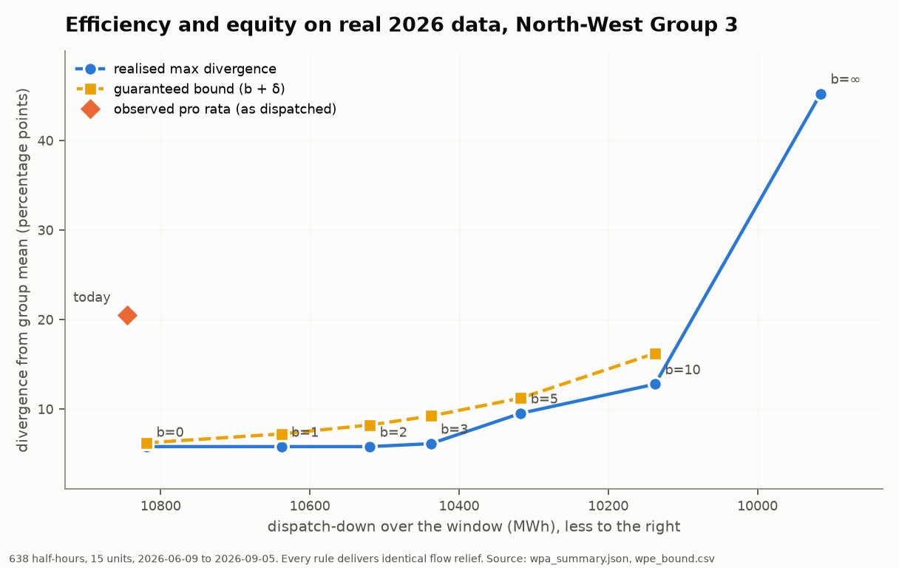
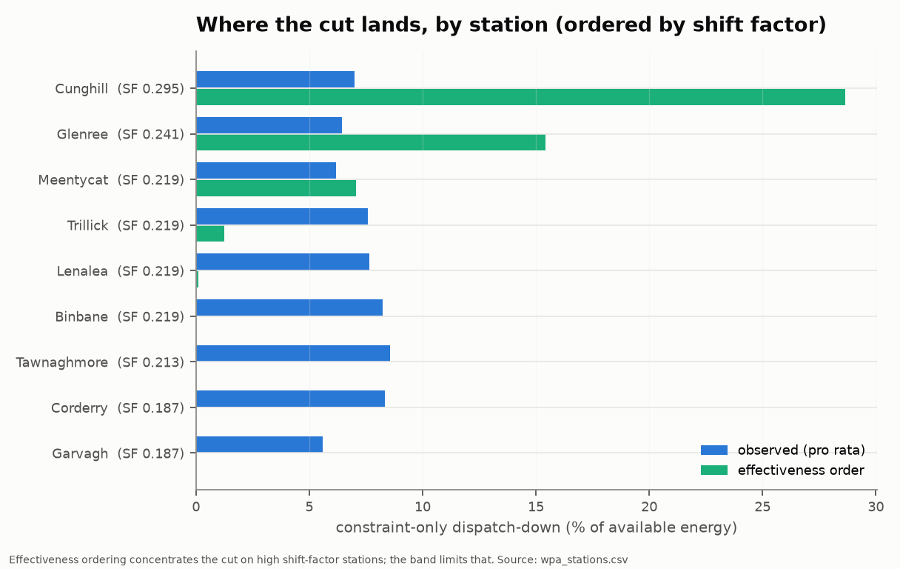

# WP-A / WP-E / WP-G results - the equal-relief replay on real data

Generated by `src/wp_results_md.py`. Every number is read from a file in
`out/`, named beside it. Nothing here was typed by hand.

## 1. What was replayed

- Window **2026-06-09 23:00:00** to **2026-09-05 23:30:00** (88.0 days).
- **638** half-hours in which North-West units were
  under constraint (LOCL active, CURL not) and delivered non-zero relief.
- **15** units at CG3 stations, matched to a model bus shift factor.
- Binding element: `SF_FLG_SLIGO_N1` (Flagford-Sligo 110 kV under loss of
  Flagford-Srananagh 220 kV). It is the only row that ever overloads in the
  main case, per `WP2024s42_overload_stats.json`.
- Station effective shift factors span **0.187** to **0.295** (`wpa_stations.csv`).

The counterfactual is constrained to deliver the *same* flow relief R as
the observed dispatch in every half-hour. Security is therefore invariant
by construction and the comparison is on MWh alone. No synthetic weather
is used anywhere in this section. Source: `wpa_summary.json`.

## 2. Headline (`wpa_summary.json`)

| rule | cut, MWh | saving vs observed, MWh | saving, % |
|---|---|---|---|
| observed (as dispatched) | 10844.5 | - | - |
| band 0 pp | 10818.9 | 25.5 | 0.24 |
| band 1 pp | 10638.1 | 206.4 | 1.90 |
| band 2 pp | 10519.5 | 325.0 | 3.00 |
| band 3 pp | 10437.8 | 406.6 | 3.75 |
| band 5 pp | 10317.2 | 527.2 | 4.86 |
| band 10 pp | 10137.2 | 707.2 | 6.52 |
| pure effectiveness | 9915.3 | 929.2 | 8.57 |

**Pro rata spilled 8.57 % more than an effectiveness-ordered cut that
delivers identical relief.** That is the cost of discarding the shift factor
at the split, measured on real instructions rather than a weather model.

Band 0 pp reproduces the observed cut to within 0.24 %. That is the
internal check that today's rule is modelled correctly: with the equity band
closed to zero the replay converges on what actually happened.

## 3. Security invariance (`wpa_assertions.csv`)

| assertion | detail | passed |
|---|---|---|
| A1 relief delivered == observed relief R | worst rel dev 3.344e-16 | yes |
| A2 cut <= declared availability | worst excess 0.000e+00 MW | yes |
| A3 no negative cut | 0 negative entries | yes |
| A4 band 0 tracks observed pro-rata | gap 0.235 % | yes |
| A5 annual cut monotone non-increasing in b | 0 breaks; totals 10819 > 10638 > 10519 > 10438 > 10317 > 10137 > 9915 | yes |
| A6 every half-hour feasible | 0 infeasible of 638 | yes |
| A7 observed r matches the measurement pipeline | 15 units, worst abs diff 8.951e-16 | yes |

A1 is the load-bearing one. Every rule delivers the observed relief to a
worst relative deviation of 3.3e-16, so no rule buys MWh with security.
This is the single line the brief asks for in WP-B.

## 4. The equity guarantee (`wpe_bound.csv`)

Claim: under the band rule of width b, r_i - rbar <= b + delta for every unit
and every half-hour, where delta is the largest single-event ratio increment.
delta is **measured**, not assumed, at **6.22 pp**.

| band, pp | guaranteed bound, pp | realised divergence, pp | holds | escapes | escape share |
|---|---|---|---|---|---|
| 0 | 6.22 | 5.80 | yes | 100 | 15.7 % |
| 1 | 7.22 | 5.80 | yes | 18 | 2.8 % |
| 2 | 8.22 | 5.80 | yes | 7 | 1.1 % |
| 3 | 9.22 | 6.13 | yes | 2 | 0.3 % |
| 5 | 11.22 | 9.52 | yes | 0 | 0.0 % |
| 10 | 16.22 | 12.78 | yes | 0 | 0.0 % |
| inf | none | 45.24 | yes | 0 | 0.0 % |

Observed pro rata realised **20.52 pp** of divergence over the window,
and offers **no ex-ante bound at all**. That asymmetry, not the point
estimate, is the legal argument.

### State this carefully

Two different comparisons are in play and they must not be blurred:

1. **Model against model.** Band 3 realises 6.13 pp against band 0's 5.80 pp - a cost of 0.33 pp - while saving 3.75 % of spill.
2. **Guarantee against reality.** Band 3's *guaranteed* bound of 9.22 pp is tighter than pro rata's *realised* 20.52 pp. This is the dominance test as the brief states it (v2, C4),
   and it passes.

The gap between modelled band 0 and observed pro rata is real-world mechanism
the replay does not carry - overlapping groups, outage variants, units already
offline. It must not be reported as something the rule caused.

Feasibility escapes fall away quickly: 100 half-hours at
b = 0, 2 at b = 3, none at b = 5 or wider. A narrow
band is the one that strains against availability, not a wide one.

## 5. Where the gain lives (`wpa_stations.csv`)

| station | units | shift factor | observed r | effectiveness r | observed cut, MWh |
|---|---|---|---|---|---|
| CUNGHILL | 1 | 0.2947 | 0.0698 | 0.2863 | 271.0 |
| GLENREE | 3 | 0.2413 | 0.0643 | 0.1542 | 2361.1 |
| MEENTYCAT | 1 | 0.2187 | 0.0618 | 0.0705 | 2549.1 |
| TRILLICK | 2 | 0.2187 | 0.0758 | 0.0125 | 1285.7 |
| LENALEA | 1 | 0.2187 | 0.0765 | 0.0011 | 1144.4 |
| BINBANE | 2 | 0.2187 | 0.0822 | 0.0000 | 594.1 |
| TAWNAGHMORE | 1 | 0.2130 | 0.0857 | 0.0000 | 723.4 |
| CORDERRY | 2 | 0.1872 | 0.0833 | 0.0000 | 705.0 |
| GARVAGH | 2 | 0.1872 | 0.0558 | 0.0000 | 1210.7 |

Effectiveness ordering concentrates the cut on the high shift-factor
stations, which is exactly the mechanism, and exactly what the band limits.

## 6. The policy dial (`wpg_weight_sensitivity.csv`)

The team does not choose the weights. This is the transfer function:

| weight on spill | winner (realised equity) | winner (guaranteed bound) |
|---|---|---|
| 0.00 | Today (pro rata) | Today (pro rata) |
| 0.05 | Band 2 pp | Today (pro rata) |
| 0.10 | Band 3 pp | Today (pro rata) |
| 0.40 | Band 5 pp | Today (pro rata) |
| 0.55 | Band 5 pp | Pure effectiveness |
| 0.70 | Pure effectiveness | Pure effectiveness |

Rows are shown where the winner changes. Full sweep in the CSV.

## 7. Can the control room run it? (`wpc_burden.csv`)

Merriman's objection is that per-farm dispatch inside a group is too
slow without automation. The implementable form keeps **one operator
action per event**: the group is pre-split into k sub-groups and the
eligible list is refreshed on a slow cadence, not solved in the hour.

Gain retained against the ideal effectiveness ordering, %:

| partition | k | hour | day | week | month |
|---|---|---|---|---|---|
| tiers | 2 | 43.7 | 44.4 | 43.9 | 39.5 |
| tiers | 3 | 18.4 | 15.5 | 12.8 | 38.8 |
| tiers | 4 | 11.2 | 24.5 | 30.2 | 54.1 |
| interleaved | 2 | 53.2 | 54.1 | 55.7 | 49.6 |
| interleaved | 3 | 42.2 | 43.7 | 37.7 | 41.9 |
| interleaved | 4 | 48.4 | 48.5 | 43.2 | 59.3 |

C5 as the brief states it - k <= 3, daily cadence, at least 50 % of the
ideal gain retained - is **falsified**: k = 2 retains 54.1 %,
k = 3 retains 43.7 %. Reported as failed rather
than softened.

The first-order choice is the partition, not k. Contiguous shift-factor
tiers perform badly because the least-burdened tier is almost always the
low-SF one, so equity-driven rotation picks the least effective units.
An interleaved split gives every sub-group a similar spread and roughly
triples retained gain at k = 3.

## 8. Limits of this section

- One summer, 88 days, one constraint group. Not a year.
- Shift factors come from the 2024 TYTFS network and are applied to 2026
  operation; the fleet has changed since.
- One binding element per event is assumed. The real tool has many outage
  variants and overlapping groups.
- Availability declarations are taken as honest.
- The SEM-O window can no longer be pulled in full: retention now starts at
  2026-06-09 23:00. See `verify/v06_measurement.md`.
- Euro, carbon and community figures are deliberately absent. Their inputs
  are still open in the brief's verification queue.
